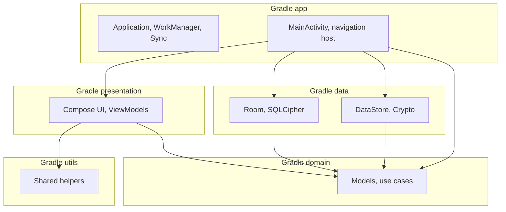

# FieldFlow

A multi-module Android app built with **Kotlin** and **Jetpack Compose** for field and operations-style workflows. It brings together ID scanning (OCR), biometric verification, activation, maps and location, notifications, background sync, and an event log.

**Türkçe:** [README.tr.md](README.tr.md)

---

## Table of contents

- [Project structure (modules)](#project-structure-modules)
- [Architecture](#architecture)
- [Technical requirements alignment](#technical-requirements-alignment)
- [Technology stack](#technology-stack)
- [Features](#features)
- [Offline operation](#offline-operation)
- [Permissions and background behavior](#permissions-and-background-behavior)
- [Notifications and alerts](#notifications-and-alerts)
- [Event log (audit trail)](#event-log-audit-trail)
- [Data lifecycle, encryption, and device security](#data-lifecycle-encryption-and-device-security)
- [Requirements](#requirements)
- [Building and running](#building-and-running)
- [Quality: tests and lint](#quality-tests-and-lint)
- [Continuous integration (CI)](#continuous-integration-ci)
- [Security and privacy notes](#security-and-privacy-notes)
- [License](#license)

---

## Project structure (modules)

| Module | Type | Role |
|--------|------|------|
| **`:app`** | Android Application | `Application` class, `MainActivity`, navigation shell, Hilt root, WorkManager configuration, OSMDroid setup, network-aware sync scheduling, foreground location service |
| **`:presentation`** | Android Library | Jetpack Compose UI, ViewModels, CameraX, ML Kit OCR (ID scan screen), map screen (OSMDroid), biometric and settings screens |
| **`:domain`** | Android Library | Business rules and models; layer kept as framework-agnostic as practical |
| **`:data`** | Android Library | Persistence: Room, SQLCipher-encrypted database, DataStore, AndroidX Security Crypto, Play Services Location, ML Kit |
| **`:utils`** | Android Library | Shared helpers (e.g. security / root detection) |

The multi-module layout is defined in `settings.gradle.kts`; dependency versions are centralized in the **Version Catalog** (`gradle/libs.versions.toml`).

---

## Architecture

The app is organized in a **layered, Clean Architecture–inspired** split:

- **Presentation**: UI (Compose), user interaction, ViewModels.
- **Domain**: models and business rules.
- **Data**: repositories / data sources, Room encrypted storage, preferences.

**Dependency injection** uses [Dagger Hilt](https://dagger.dev/hilt/); annotation processing runs through **KSP**.

**Navigation** uses [AndroidX Navigation 3](https://developer.android.com/jetpack/androidx/releases/navigation) (`navigation3-runtime`, `navigation3-ui`) with route keys (`NavKey`) serialized via **Kotlin Serialization**.



---

## Technical requirements alignment

This subsection maps common assignment / RFP-style expectations to what FieldFlow implements today.

### Architecture: layered separation and UI pattern

- **Layers**: The codebase follows **layered (Clean Architecture–inspired)** boundaries already described above: **presentation** (UI), **domain** (models + use cases), **data** (Room repositories, DataStore, platform bridges). Dependencies point inward toward **domain**.
- **UI pattern**: The presentation layer uses **MVVM**, not MVI as the primary style:
  - Jetpack **`ViewModel`** + **`StateFlow`** / `*UiState` data classes (`IdScanUiState`, `MapUiState`, etc.).
  - Compose screens collect state with **`collectAsStateWithLifecycle`** (where used) and delegate actions back to the ViewModel or lambdas.
  - Domain **`UseCase`** classes encapsulate single responsibilities (e.g. `SaveLocationUseCase`, `ObserveRecentLocationsUseCase`).
- **Presentation pattern note**: The app avoids a global sealed `UiEvent` reducer; state updates live per-screen inside ViewModels. The resulting shape is **MVVM with unidirectional state flows**, rather than a strict event-driven MVI store.

### Code quality

- **Naming**: Packages and types follow conventional Kotlin/Android naming (`*Repository`, `*UseCase`, `*ViewModel`, `*Screen`).
- **Duplication**: Repeated behavior is pushed toward **domain use cases** and **repository implementations** rather than copy-pasted across Composables; shared UI pieces are extracted where practical.
- **Verification**: **Unit tests** across modules (see [Quality: tests and lint](#quality-tests-and-lint)) help guard regressions in use cases and ViewModels.

*(README cannot replace a full style guide; adopt ktlint/detekt in CI if you need automated enforcement.)*

### Security (sensitive data + root)

- **Encrypted storage**: Location history, event logs, notifications, geofence data, etc. live in the **same SQLCipher-backed Room database**; the passphrase is held in **EncryptedSharedPreferences**. Details are in [Data lifecycle, encryption, and device security](#data-lifecycle-encryption-and-device-security).
- **Root / jailbreak**: This is an **Android** project; **jailbreak** applies to iOS. Here, **root detection** is implemented via **`RootDetector`** (heuristic file/tag checks). **`MainNavigationHost`** shows a **security dialog** that the user must acknowledge; the app is **not** blocked outright.
- **Limits**: Root detection is **best-effort**; pairing with Play Integrity or MDM is recommended for strict policies.

### Error handling (user-facing vs technical)

- **Principle**: Failures are **logged** for developers (`Log` / stack traces in logs) while the UI shows **short, actionable copy** from **`strings.xml`** (or mapped strings), not raw exception messages.
- **Examples**:
  - **ID scan**: CameraX / ML Kit failures call **`onError(...)`** with resources such as `id_scan_photo_capture_failed`, `id_scan_text_read_failed`, `image_processing_failed`; technical detail stays in **`Log.w`**.
  - **Biometrics**: `BiometricPrompt` error codes are mapped through **`messageForPromptAuthenticationError`** to user-safe strings (`biometric_unavailable`, lockout, timeout, etc.); vendor strings from the framework are **not** shown verbatim.
- **Gaps to audit**: Any new screen should keep the same rule—**never** surface `exception.message` directly in Compose/Toast without sanitization.

---

## Technology stack

The tables below summarize the main libraries and tools used **directly** in the project. Exact versions align with the **refs** in `gradle/libs.versions.toml`.

### Platform and language

| Component | Notes |
|-----------|--------|
| **Kotlin** | 2.0.21 |
| **Android Gradle Plugin (AGP)** | 8.10.1 |
| **KSP** | 2.0.21-1.0.28 |
| **JVM target (sources)** | Java 11 (`compileOptions` / `kotlinOptions.jvmTarget`) |
| **minSdk / compileSdk / targetSdk** | 24 / 36 / 36 |
| **Application ID** | `com.example.fieldflow` |

### AndroidX and UI

| Library | Version (ref) | Usage |
|---------|---------------|--------|
| **core-ktx** | 1.18.0 | Kotlin extensions |
| **Activity Compose** | 1.11.0 | `ComponentActivity` + Compose |
| **Compose BOM** | 2024.09.00 | Compose version alignment |
| **Material 3** | (BOM) | Design system |
| **material-icons-extended** | (BOM) | Extended icon set (`presentation`) |
| **lifecycle-runtime-ktx** | 2.9.4 | Lifecycle |
| **lifecycle-viewmodel-compose** | 2.9.4 | ViewModel + Compose |
| **navigation-compose** | 2.8.5 | Declared in catalog; modules primarily use Navigation 3 |
| **Navigation 3** runtime + ui | 1.1.1 | Type-safe navigation back stack |
| **Biometric** | 1.1.0 | Fingerprint / face unlock |
| **CameraX** (core, camera2, lifecycle, view) | 1.6.1 | Camera preview and capture |
| **WorkManager** (KTX) | 2.9.1 | Background work |
| **DataStore Preferences** | 1.1.1 | Preferences / light configuration |
| **Room** (runtime, ktx) | 2.7.0 | Local relational data |
| **security-crypto** | 1.1.0 | Keystore-backed secure preferences |
| **SQLCipher (android-database-sqlcipher)** | 4.5.4 | Encrypted SQLite |

### Google, maps, and location

| Library | Version | Usage |
|---------|---------|--------|
| **Play Services Location** | 21.3.0 | Location APIs |
| **ML Kit Text Recognition** | 16.0.1 | ID / text OCR |
| **OSMDroid** | 6.1.20 | Open map tile–based map view |

### DI and asynchronous code

| Library | Version | Usage |
|---------|---------|--------|
| **Hilt** (Android) | 2.51.1 | App-wide DI |
| **Hilt Navigation Compose** | 1.2.0 | Hilt with Compose |
| **Hilt Work** + **Hilt Compiler (AndroidX)** | 1.2.0 | WorkManager worker injection |
| **Kotlin Coroutines** (android) | 1.8.1 | Asynchronous flows |
| **kotlinx-serialization-json** | 1.7.3 | Route and config serialization |

### Testing

| Library | Version | Usage |
|---------|---------|--------|
| **JUnit 4** | 4.13.2 | Unit tests |
| **AndroidX Test JUnit** | 1.3.0 | Instrumentation test plumbing |
| **Espresso** | 3.7.0 | UI tests |
| **kotlinx-coroutines-test** | 1.8.1 | Dispatcher control |
| **AndroidX Test Core** | 1.6.1 | Test doubles / Android components |
| **Robolectric** | 4.14.1 | JVM Android unit tests |
| **Compose UI Test (JUnit4)** | (BOM) | Compose UI tests |

### Tooling

- **Gradle Wrapper** (validated in CI: `gradle/actions/wrapper-validation`)
- **Version Catalog** (`libs.versions.toml`)
- Release builds: **R8** code shrinking and resource shrinking (enabled on the `app` module)

---

## Features

End-user flow (summary):

1. **Launch / ID scan**: `IdScanScreen` with ML Kit OCR and CameraX.
2. **Activation**: After scan, `ActivationCodeScreen` activation code flow.
3. **Biometric verification**: `BiometricAuthScreen`.
4. **Home**: `HomeScreen` — navigation to map and event log.
5. **Map**: OSMDroid-based `MapScreen`.
6. **Event log**: `EventLogScreen`.
7. **Notifications**: List and detail screens; deep-link–style routing via `MainActivity` extras.
8. **Settings**: `SettingsScreen`.

### Settings preferences (`SettingsScreen`)

Navigation passes **`isActivated`** (mirroring **`activationStore`**) into **`SettingsScreen`** so unfinished onboarding keeps sensitive knobs read-only (**`MainNavDisplay`**, **`presentation/.../SettingsScreen.kt`**). **`SettingsViewModel`** reads/writes **`UserPreferences`** through **`SettingsRepositoryImpl`** (**Preferences DataStore** separate from **`activation_prefs`** — see **[Settings vs secrets](#settings-vs-secrets)**).

**Language.** Two **`ElevatedFilterChip`** entries flip **`AppLanguage.TURKISH`** (**`tr`**) versus **`AppLanguage.ENGLISH`** (**`en`**). **`FieldFlowApp`** observes **`prefs.language`**; **`Configuration#setLocale`** is injected via **`CompositionLocalProvider(LocalConfiguration)`** and **`Activity.resources.updateConfiguration`**, aligning **`Locale.setDefault`** without forcing an **`Activity`** recreate.

**Location update cadence.** Chips enumerate **`LOCATION_INTERVALS`** — **30 / 60 / 120 / 300** seconds (**`presentation/.../SettingsScreen.kt`**). Chips stay disabled with **`lockedHint`** until **`isActivated` is **`true`**; **`setLocationInterval`** then persists **`location_interval_seconds`** (defaults to **60** in **`UserPreferences`** when untouched). Behaviour on the fused pipeline is spelled out under **[Sampling cadence and local persistence](#sampling-cadence-and-local-persistence)**.

**Theme.** Chips expose **`LIGHT`**, **`DARK`**, and **`SYSTEM`**; defaults favor **`SYSTEM`**. **`FieldFlowApp`** derives **`darkTheme`** from **`isSystemInDarkTheme()`** whenever **`prefs.theme`** requests system mode and toggles Compose **Material 3** **`dynamicColor`** only while **`SYSTEM`** is selected (**`FieldFlowTheme`**).

### First launch: ID OCR, activation code, and biometric unlock on return

When **`AppActivationStore.isActivated`** is **false**, **`MainNavigationHost`** advances from **`SplashRoute`** to **`ScanRoute`**, so first-run onboarding opens **`IdScanScreen`**.

**Card capture and OCR.** User-facing copy in **`presentation/src/main/res/values/strings.xml`** (**`id_scan_description`**) tells the holder to present the **front** of an ID within **`IdCardViewfinderOverlay`**. **`CameraX`** **`ImageCapture`** freezes a frame; **ML Kit Text Recognition** OCR runs (**`captureAndRunOcr`**), yielding raw text **`IdScanViewModel`** parses into **`IdentityInfo`** (**name**, **surname**) via **`IdentityTextParser`**. **Enter details manually** (**`IdScanConfirmContent`**) skips the shutter path while preserving the confirmation step before **`MainNavRouter.onIdentityDetected`** runs.

After confirmation, **`onIdentityDetected`** enqueues **`ActivationRoute`** (**name**/surname parameters carried on **`NavKey`** routes).

**Activation entry.** **`ActivationCodeScreen`** compares user input against **`AppActivationStore.getExpectedActivationCode()`**. That expectation is produced locally from embedded AES-GCM material, then optionally **re-sealed** with **hardware Keystore-backed** AES-GCM values in **`activation_prefs` DataStore**—this reference build performs **no** remote OTP issuance. When the typed code matches the expected string, **`onActivationCodeSuccess`** writes **`setActivated(true)`**, assigns **`rememberSaveable` `isBiometricVerified`** in **`MainNavigationHost`** to **true**, and routes **`HomeRoute`**, so **BiometricPrompt** is skipped **only in that same freshly activated session**. The provisioning chain (camera/manual identity → activation form) stays suppressed while **`is_activated`** stays **true**, unless onboarding storage is erased.

**Returning visits.** A new **`MainActivity`** instance initialises **`isBiometricVerified = false`**; whenever **`activationStore.isActivated`** is **true** and the latch stays **false**, **`MainNavigationHost`** replaces the stack with **`BiometricRoute`**. **`BiometricAuthScreen`** consults **`BiometricManager.canAuthenticate(BiometricManager.Authenticators.BIOMETRIC_WEAK)`** before **`BiometricPrompt`**—Face unlock, fingerprint enrollment, etc. mirror whichever **weak** biometrics the OEM exposes locally. The success callback lifts **`isBiometricVerified`** before **`HomeRoute`**. **`rememberSaveable`** can persist **true** through process recreation (**`SavedStateRegistry`**); deployments that insist on biometric on every absolute cold boot must decide whether this scaffold suffices or needs hardening beyond **`SavedStateRegistry`** defaults.

### Map route playback

The map screen reconstructs motion from persisted breadcrumbs rather than a separate media timeline. Stored recent locations flow through **`ObserveRecentLocationsUseCase`** into **`MapViewModel`**; **`MapUiState`** supplies the drawn polyline. When the retained path contains **at least two** points, the bottom sheet exposes a control that invokes **`startPlayback()`**, which launches a scoped coroutine. Each tick awaits **`delay(PLAYBACK_STEP_MS)`** (**500 ms**; defined in **`presentation/src/main/java/com/example/presentation/constants/UiConstants.kt`**) before incrementing **`PlaybackState.index`**: the polyline shows only the prefix through that index while the position marker follows the active sample. **`stopPlayback()`** cancels the job and clears the transient index—normal tracking view resumes showing the complete trail according to **`uiState`** rules. Playback consumes only encrypted local Room data behind the observer; neither tile download nor outbound APIs are required during review.

### Trail window and the “current location” marker

`MapScreen` composes its track **`Polyline`** from **`MapUiState.trackPoints`**, sourced in **`MapViewModel`** via **`ObserveRecentLocationsUseCase`**. That pathway applies **`DAY_MS`** (**24 × 60 × 60 × 1000**) so **`getLocationsAfter(System.currentTimeMillis() - DAY_MS)`** emits every **`location_records`** row whose **`timestamp`** still lies inside that trailing window (**`LocationDao`** returns them **`ORDER BY timestamp ASC`**). Visible samples remain subject to **`SaveLocationUseCase`** retention (sync-aware pruning); for the interplay between the cutoff and bookkeeping see [Location history: the 24-hour window](#location-history-the-24-hour-window-and-the-seven-day-safety-net).

The pin titled **current location** comes from **`MapUiState.currentLocation`**, computed as **`allPoints.lastOrNull()`** mapped from the location record list—not a Compose-scoped fused provider subscription. **`LocationForegroundService`** updates the trail only when **`LocationDao.insert`** runs; whenever that **`Room`** **`Flow`** re-emits, the marker reaches the freshest saved coordinate—without new persisted fixes the overlay remains static regardless of latent GNSS motion. **`MapScreen`** may read **`LocationManager#getLastKnownLocation`** solely to approximate an **initial** camera center before any breadcrumbs exist (**`LaunchedEffect` without `currentLocation`**); that bootstrap path does **not** drive the stored polyline during normal operation.

During **[playback](#map-route-playback)**, **`OsmMapView`** feeds **`trackPoints.getOrNull(playbackIndex)`** into the marker so the pin tracks the deliberate replay cadence described above rather than **`lastOrNull()`**.

Background:

- **WorkManager** for sync; `FieldFlowApplication` registers a **network callback** to schedule sync when validated internet is available, plus a periodic fallback.
- **`LocationForegroundService`**: foreground service type `location`.
- **OSMDroid**: cache and user agent configured in `Application.onCreate`.

---

## Offline operation

The app does **not** ship a separate “offline mode” switch; instead it behaves **offline-capable** by treating the device database as the **source of truth** and scheduling **network-gated** background work only when the OS reports usable connectivity.

### Local persistence while connectivity is unavailable

**Locations**

- **`LocationForegroundService`** requests fixes from **`FusedLocationProviderClient`** independently of packet data. With GNSS / fused logic available, coordinates can still be produced when **Wi‑Fi and mobile data are absent**.
- Each accepted fix is written through **`SaveLocationUseCase`** → **`LocationRepository`** → **`LocationDao.insert`**. There is **no pre-check** for internet access on this path: outages do **not** block persistence.
- Rows are stored in **`location_records`** (`LocationEntity`) with **`is_synced = false`** until a sync pass marks them.

**Event records**

- **`SaveEventUseCase`** writes **`event_records`** directly (same encrypted Room DB). Examples produced around connectivity changes include **`INTERNET_LOST`** / **`INTERNET_RESTORED`** emitted from **`LocationForegroundService`** when **`StatusRepository.observeConnectivity()`** flips—still fully **local-first**.
- Geofence lifecycle events and other domain events follow the same repository path.

**Storage characteristics**

- Both domains share **SQLCipher-backed Room** (`fieldflow.db`), so offline backlog benefits from the same **at-rest encryption** described under [Data lifecycle…](#data-lifecycle-encryption-and-device-security).
- **Unsynced** location rows are retained **longer** than synced ones (**7-day** window vs **24-hour** trimming for synced)—by design so transient outages do not immediately lose points before **`SyncWorker`** can run ([retention table](#location-history-the-24-hour-window-and-the-seven-day-safety-net)).

### Automatic processing when connectivity returns

**Triggers**

1. **`FieldFlowApplication`** registers **`ConnectivityManager.NetworkCallback`** and, when capabilities include **`NET_CAPABILITY_INTERNET`** and **`NET_CAPABILITY_VALIDATED`**, calls **`SyncWorker.schedule`**.
2. **`LocationForegroundService`** collects **`observeConnectivity()`**: on transition to **online**, it **`SyncWorker.schedule`**’s again (and records **`INTERNET_RESTORED`**); on loss it logs **`INTERNET_LOST`** and may surface a notification.
3. **Cold start**: `onCreate` already schedules a **one-shot** sync and registers **periodic** fallback work (`SYNC_PERIODIC_INTERVAL_HOURS`), both constrained to **`NetworkType.CONNECTED`**.

**SyncWorker bookkeeping semantics**

- **`SyncWorker`** executes **only** when **`NetworkType.CONNECTED`** is satisfied. It reads **`getUnsyncedLocations()`** and **`getUnsyncedEvents()`**, then writes **`is_synced = 1`** and **`synced_at = now`**—current builds perform **local bookkeeping only** without HTTP upload ([worker responsibilities](#syncworker-responsibilities)).
- The scheduling hooks (`FieldFlowApplication` callbacks, foreground-service observers, periodic fallback) implement **automatic post-connect processing** on the device. A remote reconciliation API fits naturally **inside** or **after** this worker while retaining the same **`unsynced` row queue + connectivity triggers**.

### Temporal integrity (timestamps)

**Capture time vs sync bookkeeping**

- **`timestamp`** on **`location_records`** and **`event_records`** reflects **when the measurement or event occurred** (for locations: typically **`Location.getTime()`**, falling back to **`System.currentTimeMillis()`** when invalid). It is **written once at insert** and **not rewritten** when **`markLocationsSynced`** / **`markEventsSynced`** runs.
- **`synced_at`** is a **separate column**: it records **when** the row was marked synced locally—useful for audits and retention logic without overwriting the original observation time.

**Offline duration**

- Clock drift aside, **ordering and chronology** of data collected during an outage remain intact in SQLite; reconnecting does **not** collapse or reset historical **`timestamp`** values.

### Other offline-capable surfaces

- **Map playback**: Replay uses the flow described above—**[Map route playback](#map-route-playback)** under Features—purely offline against **`ObserveRecentLocationsUseCase`** backing data.
- **On-device OCR**: **ML Kit** does not require a backend hop once models are present.
- **Activation flag**: persisted locally (**DataStore** / crypto path)—already-activated sessions open without internet.

### Map tiles caveat (**OSMDroid**)

Basemap **tiles** are normally fetched over **HTTPS**. Offline maps usually require **tiles already cached** under **`cacheDir`** from earlier online sessions. GPS breadcrumbs may render while the basemap appears blank on a fresh offline device.

### Home status dashboard (`HomeScreen`)

While **`HomeScreen`** remains composed, **`HomeViewModel`** exposes **`HomeUiState`** through **`combine`** of repository and permission flows under the welcome text.

1. **Internet** — **`StatusRepositoryImpl.observeConnectivity`** attaches **`ConnectivityManager.registerNetworkCallback`** with a **`NetworkRequest`** gated on **`NET_CAPABILITY_INTERNET`**, emitting a boolean as networks advertise or lose workable internet-bearing capability (**`distinctUntilChanged`** **`Flow`**). **`StatusCard`** reflects online vs offline and **`launchSettingsSafely(ACTION_WIRELESS_SETTINGS)`** opens radios.
2. **System-wide location toggle** — **`observeLocationEnabled`** registers **`BroadcastReceiver`** for **`LocationManager.MODE_CHANGED_ACTION`**, recomputes **`LocationManager.isLocationEnabled`**, so the banner tracks when GNSS/providers are switched off globally (**`StatusRepositoryImpl`** annotated for Android **P**).
3. **Runtime `ACCESS_BACKGROUND_LOCATION` (Android 10+, API 29+)** — Presented only when **`Build.VERSION.SDK_INT ≥ Q`**. Boolean derives from **`ContextCompat.checkSelfPermission`** (**`RuntimePermissions.hasBackgroundLocationPermission`**). **`HomeScreen`** calls **`refreshRuntimePermissions()`** on **`Lifecycle.ON_RESUME`** and after the **`ActivityResultContracts.RequestPermission`** callback because Android emits no perpetual permission-diff stream beyond those hooks.
4. **Runtime notifications (`POST_NOTIFICATIONS`, Android 13+)** — analogous **`checkSelfPermission`** snapshots; **`Tiramisu`**+ shows denied vs granted, earlier levels treat **`true`** implicitly (**`HomeViewModel.checkNotificationPermission`**).
5. **Battery percentage** — **`observeBatteryLevel`** parses **`BatteryManager.EXTRA_LEVEL`** / **`EXTRA_SCALE`** from **`ACTION_BATTERY_CHANGED`** sticky updates; **`BatteryStatusCard`** renders the percent (negative sentinel values show “measuring” copy until the first broadcast) with warn styling aligned to low thresholds (**20%**) consistent with alerting elsewhere.

Fine / coarse **`ACCESS_FINE_LOCATION`** / **`ACCESS_COARSE_LOCATION`** are **not** mirror-status tiles on Home—they are gated through **`LaunchedEffect`** and **`rememberLauncherForActivityResult`** flows (sequenced with POST_NOTIFICATIONS + background prompts). **`MapScreen`** still shows its **`PermissionRequired`** sheet when **`ACCESS_FINE_LOCATION`** lapses independently.

**`LocationForegroundService`** continues subscribing to the same **`StatusRepository`** **`Flow`**s for notifications/events as summarized under **Offline operation** earlier.

---

## Permissions and background behavior

Main permissions declared in `AndroidManifest.xml`:

- **Network**: `INTERNET`, `ACCESS_NETWORK_STATE`
- **Camera**: `CAMERA` (optional hardware: `camera` `required=false`)
- **Biometric**: `USE_BIOMETRIC`
- **Location**: `ACCESS_FINE_LOCATION`, `ACCESS_COARSE_LOCATION`, `ACCESS_BACKGROUND_LOCATION`
- **Notifications**: `POST_NOTIFICATIONS`
- **Foreground service**: `FOREGROUND_SERVICE`, `FOREGROUND_SERVICE_LOCATION`
- **Battery optimization**: `REQUEST_IGNORE_BATTERY_OPTIMIZATIONS`

WorkManager’s default initializer is removed via manifest merge; configuration is supplied at the application level with **HiltWorkerFactory** (custom startup).

---

## Notifications and alerts

### Local notifications

Alerts are **local notifications**: they are built **on the device** with **`NotificationManager`** / **`NotificationCompat`** inside **`NotificationHelper`** (`app` module), usually when tracking, geofence rules, connectivity, or battery thresholds fire. There is **no remote messaging backend** driving notification content.

### Local notification architecture

- **Channels**: `CHANNEL_TRACKING` (low importance, silent **ongoing** foreground notification while tracking), `CHANNEL_GEOFENCE` (high-importance alerts), `CHANNEL_SYSTEM` (connectivity / location service / battery).
- **Entry points**: Geofence exit, internet loss/restore side effects, location provider toggles, and battery thresholds trigger `NotificationHelper` from **`LocationForegroundService`** (and related flows).
- **In-app history**: Many alerts also persist a **`NotificationRecord`** via **`SaveNotificationUseCase`** → Room, powering **`NotificationListScreen`** / **`NotificationDetailScreen`**.

### Shade disclosure versus in-app detail

OS **status bar / shade** strings intentionally remain **generic** (`notif_*_title`, `notif_*_text` in `app` … `values/strings.xml`). Context such as geofence zone **names** or battery **numerics** travels through **`PendingIntent`** extras (`EXTRA_NOTIF_TYPE`, `EXTRA_NOTIF_TIMESTAMP`, `EXTRA_NOTIF_EXTRA_ARG`) so **`MainActivity`** can launch **`NotificationDetailScreen`** with **`notif_*_detail`** templates for the full narrative.

| Alert | Tray `setContentTitle` / `setContentText` | Sensitive / contextual data |
|-------|-------------------------------------------|-----------------------------|
| Geofence exit | Generic “Security Alert” + text that **does not name the zone** in the collapsed line | Zone **name** passed only as `extraArg` for navigation + stored for in-app list/detail |
| Internet lost | Generic connectivity wording | No coordinates or identity |
| Location services off | Generic “tracking stopped” wording | No coordinates |
| Battery low | Short line includes **battery percentage** (`%1$d%%`)—operational, not GPS/PII | Full prose in detail screen |
| Foreground tracking | Generic active/run message | No coordinates |

**Operational practices**

- **`NotificationHelper`** does **not** use **`BigTextStyle`** or expanded bodies that could duplicate sensitive prose in the shade.
- **In-app list rows** (`NotificationListScreen`, `notificationSubtitle`) may show a **one-line summary** that includes `extraArg` (e.g. zone label)—that surface is **inside the authenticated app**, not the OS tray.
- **Residual risk**: Any notification text can appear on **lock screens** depending on user/OS privacy settings; treat shade content as **semi-public** and keep minimizing identifiers (consider moving battery % entirely into the app if policy requires).

---

## Event log (audit trail)

### Automatic persistence pipeline

**`LocationForegroundService`** observes connectivity (`StatusRepository`), Android P+ location-provider availability, and geofence hysteresis logic; qualifying transitions invoke **`SaveEventUseCase`**, persisting **`EventRecord`** rows inside encrypted **`event_records`** Room storage.

| Trigger | `EventType` values | Behaviour notes |
|---------|-------------------|-----------------|
| Internet connectivity transitions | **`INTERNET_LOST`**, **`INTERNET_RESTORED`** | First emitted sample is suppressed so boot noise is ignored; later flips persist. |
| System location provider toggles (Android P+) | **`LOCATION_SERVICE_DISABLED`**, **`LOCATION_SERVICE_ENABLED`** | Same suppression pattern as connectivity. |
| Geofence logical enter/exit | **`GEOFENCE_ENTER`**, **`GEOFENCE_EXIT`** | Written alongside dedicated geofence entities; **`detail`** typically stores the human-readable **zone name**. |

Battery-low signalling posts **`NotificationHelper`** alerts **without** extending **`EventRecord.EventType`**—audit rows currently cover connectivity, provider toggles, and geofence transitions only.

### `EventLogScreen` presentation model

**`EventLogViewModel`** collects **`ObserveAllEventsUseCase`** (time-ordered **`Flow`**). Each **`EventRecordCard`** renders:

- Localized **`EventRecord.EventType`** title text.
- **`toFormattedDate(timestamp)`** reflecting **observation time**, independent of optional **`syncedAt`** bookkeeping.
- Optional **`detail`** subtitle (common when geofence metadata includes a zone label).
- Iconography and container tint conveying categorical severity—purely presentational hints rather than a persisted workflow-status enum.

The entity still carries **`isSynced` / `syncedAt`** for **`SyncWorker`** reconciliation; the Compose implementation **does not** surface pending-vs-synced badges yet—those fields remain integration hooks.

### Optional operator annotations

**`EventRecord.note`** defaults empty. Row taps launch **`NoteDialog`**; trimmed input persists via **`UpdateEventNoteUseCase`** → **`EventRepository.updateNote`**. Non-empty notes preview inline after capture—there is **no** requirement to annotate every automated incident.

---

## Data lifecycle, encryption, and device security

This section describes how the codebase actually behaves today—not just which libraries are on the classpath.

### Location history: the 24-hour window (and the seven-day safety net)

Location retention is defined in `domain/.../DataRetentionConstants.kt`:

| Constant | Duration | Purpose |
|----------|----------|---------|
| `DAY_MS` | 24 hours | Base “day” used for UI and pruning rules |
| `SYNCED_LOCATION_RETENTION_MS` | 24 hours | After each new location save, **already-synced** points older than 24 hours are deleted |
| `UNSYNCED_LOCATION_RETENTION_MS` | 7 days | Rows still **unsynced** are only deleted if older than seven days (gives WorkManager more time to mark sync while offline) |

`SaveLocationUseCase` always inserts the new point, then calls both delete helpers with cutoffs derived from “now.” So **synced** trail on disk is trimmed to roughly the **last 24 hours**; **unsynced** data can survive longer.

The map / “recent locations” path uses `ObserveRecentLocationsUseCase`, which subscribes to `getLocationsAfter(now - DAY_MS)`—so anything the UI treats as “recent” is explicitly **the last 24 hours** of timestamps still present in the table.

### SyncWorker responsibilities

`SyncWorker` executes whenever **`NetworkType.CONNECTED`** constraints succeed (including periodic fallback). It enumerates **unsynced** locations/events and marks them **`is_synced`** with a fresh **`synced_at`** timestamp—**without HTTP upload** in the reference implementation. Extending the worker with outbound APIs preserves the same queue semantics while satisfying backend reconciliation requirements.

### At-rest encryption (Room / SQLCipher)

1. **`DatabasePassphraseStore`** (`data` module) keeps the SQLCipher passphrase in **EncryptedSharedPreferences** (`androidx.security:security-crypto`): **AES-256-GCM** master key in the Android Keystore, preference keys/values encrypted (SIV + GCM).
2. On first launch it generates a **48-character** random passphrase (`SecureRandom`) and stores it in those encrypted prefs.
3. **`DatabaseModule`** loads SQLCipher native libs, builds Room with `SupportFactory(passphraseBytes)` so `fieldflow.db` is a **SQLCipher-encrypted** SQLite file.
4. **`SqlCipherDatabaseMigrator`** detects a legacy **plaintext** `fieldflow.db`, exports it into a new encrypted file via `sqlcipher_export`, and removes the backup. If migration fails, artifacts may be wiped so an empty encrypted DB can be created; **Room is also configured with `fallbackToDestructiveMigration(true)`**, so schema issues can destroy local data—acceptable for a template app but worth knowing for production.

All **Room** tables (locations, events, geofence zones/events, notifications, etc.) live in that single encrypted database file.

### Activation secrets (`AppActivationStore`)

The activation flow stores:

- `is_activated` in **Preferences DataStore** (`activation_prefs`).
- The expected activation code: first derived from an **embedded AES-GCM blob** (key material gated by a **SHA-256–derived** AES key from a compile-time label); then **re-sealed** with a **hardware-backed / Keystore** AES-GCM key and stored as Base64 in DataStore.

So the code path uses **two layers**: obfuscation/embedding plus **Keystore-backed** encryption for what ends up on disk. This is **not** a substitute for server-side licensing or enterprise attestation.

### Settings vs secrets

`SettingsRepositoryImpl` uses a separate **DataStore** for language, theme, and **location sampling interval** (default **60 seconds**). Those preferences are **not** the same as EncryptedSharedPreferences/SQLCipher; rely on Android app sandboxing.

### Root and “compromised device” handling

**`RootDetector`** (`utils`) combines:

- `Build.TAGS` containing `test-keys` (common on unofficial builds).
- Existence checks for a fixed list of paths (e.g. `su`, **Magisk** paths, `Superuser.apk`).

It is **heuristic**: false positives/negatives are always possible. **`MainNavigationHost`** shows a **non-blocking** `AlertDialog`: the user must acknowledge the warning; the app is **not** hard-disabled. For higher assurance you would combine Play Integrity, enterprise policy, or remote attestation.

### Continuous location capture and geofencing

**`LocationForegroundService`** (type `location`):

- Starts as a **foreground** service with a persistent notification (`NotificationHelper`).
- Uses **Google Play services** `FusedLocationProviderClient` with **high accuracy** and an update interval driven from user settings (`locationIntervalSeconds`, converted to milliseconds).
- On each fix it runs **`SaveLocationUseCase`** (triggering retention) and **`checkGeofences`** against stored zones: hysteresis (separate enter/exit thresholds and **two-sample confirmation**) reduces GPS jitter flapping.
- **ENTER/EXIT** geofence events are written to Room and mirrored into the generic **event log**; notifications can fire on exit (and other system-derived alerts).

While the service runs, coroutines also observe **connectivity**, **location service enabled** (P+), and **battery level**; transitions feed **`SaveEventUseCase`** and notification helpers (e.g. internet lost, location disabled, battery low).

#### Sampling cadence and local persistence

**Tracking lifecycle.** Starting **tracking** (map or home) asks **`TrackingRepositoryImpl`** to launch **`LocationForegroundService`**. That **`location`**-typed **foreground** service—visible via the persistent notification—is the authoritative path by which fused fixes arrive; there is **no** separate periodic WorkManager sampler for coordinates.

**User-configurable interval.** The nominal spacing between fused updates derives from **`UserPreferences.locationIntervalSeconds`**, surfaced by **`settingsRepository.preferences`** and persisted under **`SettingsRepositoryImpl`** (**Preferences DataStore**, key **`location_interval_seconds`**). **`UserPreferences`** defaults to **60** seconds when preferences are absent; **`SettingsScreen`** exposes selectable chips (**30**, **60**, **120**, **300** seconds, see **`LOCATION_INTERVALS`**) and forwards changes through **`SettingsViewModel`** only after **activation**. **`LocationForegroundService.startObservingInterval()`** maps **`locationIntervalSeconds`** to milliseconds (**`distinctUntilChanged`**) and calls **`restartLocationUpdates`**, so editing the Setting restarts **`requestLocationUpdates`**.

**Request shape.** **`startLocationUpdates`** configures **`LocationRequest.Builder(Priority.PRIORITY_HIGH_ACCURACY, intervalMs)`**, **`setMinUpdateIntervalMillis(intervalMs / 2)`**, and attaches a **`LocationCallback`** to **`FusedLocationProviderClient`**. **`PRIORITY_HIGH_ACCURACY`** requests Play services’ fused, GNSS-aided pipeline—not an exclusive **`GPS_PROVIDER`** hardware poll at a fixed baud.

**Writes to SQLite.** Each **`LocationCallback.onLocationResult`** maps **`Location`** into **`LocationRecord`** (latitude, longitude, **`location.time`** when valid, otherwise **`System.currentTimeMillis()`**) and invokes **`SaveLocationUseCase`** so the row persists through **`LocationRepository`** → **`LocationDao.insert`** into encrypted **`location_records`**, after which **`SaveLocationUseCase`** applies retention trims.

Cadence observed in telemetry will still drift with OEM power governors, chipset behavior, fused batching quirks, **`ACCESS_BACKGROUND_LOCATION`** where applicable, user toggling location off, etc.; **`intervalMs`** is the nominal Android request horizon, not a wall-clock SLA.

#### Safe zones (circular geofences)

Safe zones are **circular**. **`GeofenceZone`** stores **`centerLat`**, **`centerLng`**, and **`radiusMeters`**. **`MapScreen`** renders each zone as a polygon that approximates the circle (**`generateCirclePoints`**). **`LocationForegroundService`** computes distance with **`Location.distanceBetween`** at every fix—the implementation does **not** use **`GeofencingClient`**.

The **`geofence_zones`** table is initially **empty**; there are **no** bundled default regions. Zones are created only through the map flow (name, latitude, longitude, radius).

While **`LocationForegroundService`** receives updates, it invokes **`checkGeofences`** after each fusion result. Classification is inactive if tracking stops or **no** zones exist. Timing of transitions depends on **`locationIntervalSeconds`**, fused fix availability, **`ACCESS_BACKGROUND_LOCATION`** where relevant, and typical OEM foreground/background scheduling.

Logical exit treats the perimeter as **`radiusMeters`** plus **`GEOFENCE_EXIT_HYSTERESIS_METERS`** (**25** m); a transition commits after **`GEOFENCE_CONFIRMATION_SAMPLES`** (**2**) successive qualifying readings. Re-entry **`enterThresholdMeters`** derives from **`GEOFENCE_ENTER_HYSTERESIS_METERS`**. Definitions appear in **`LocationForegroundService`**’s companion.

On **`prevInside → outside`**, in order: **`SaveGeofenceEventUseCase`** persists **`EXIT`** to **`geofence_events`**; **`SaveEventUseCase`** inserts **`GEOFENCE_EXIT`** **`EventRecord`** with **`detail`** set to the zone name into **`event_records`**; **`NotificationHelper.sendGeofenceExitAlert`** raises a **local** notification on **`CHANNEL_GEOFENCE`** and stores **`NotificationRecord`**. Collapsed tray copy remains generic (**[Notifications and alerts](#notifications-and-alerts)**; extras carry richer context).

**ENTER** persists **`ENTER`** **`GeofenceEvent`** and **`GEOFENCE_ENTER`** **`EventRecord`** rows **without** calling **`sendGeofenceExitAlert`**.

### Identity scan (OCR)

The **ID scan** screen uses **CameraX** and **ML Kit Text Recognition**. `IdScanViewModel` parses OCR text into `IdentityInfo` (name/surname). That data is used in the **activation** navigation flow; it is not inherently encrypted in a separate vault beyond whatever ends up in the encrypted DB if you persist it elsewhere—**follow the code paths** for your compliance story.

### Event log, geofence history, notifications

- **Event records** (`event_records`) and **notifications** have **no automatic 24-hour purge** in the same way as synced locations; they accumulate until you add pruning or user deletion APIs.
- **Geofence events** in the UI are observed via `observeRecentEvents(limit = 50)` by default—recent **count**, not a 24-hour cutoff.

### Threat model (short)

| Control | What it helps with | What it does **not** guarantee |
|---------|-------------------|----------------------------------|
| SQLCipher + encrypted passphrase store | Device theft / offline disk imaging of app storage | Rooted attacker reading memory, malware with root, backups if misconfigured |
| Keystore + GCM for activation | Tamper-resistant sealing of stored activation material | Recovery of embedded secrets from reverse-engineered APK, side-channel attacks |
| RootDetector + dialog | User awareness, light policy signal | Stealth root, unknown paths, custom ROMs without `su` binary |
| Foreground location + explicit permissions | User-visible tracking, OS consent | User bypassing GPS, location spoofing apps |

---

## Requirements

- **Android Studio** (a current release compatible with AGP 8.10.x is recommended)
- **JDK**: project sources target **Java 11** language level. For local development, Android Studio’s bundled JDK is usually sufficient; **CI uses JDK 17** (Eclipse Temurin).

---

## Building and running

From the repository root after cloning:

```bash
./gradlew assembleDebug
```

For release APK/AAB you must add your own `signingConfig`; the template uses application id `com.example.fieldflow`.

---

## Quality: tests and lint

```bash
./gradlew testDebugUnitTest lint
```

### Unit test inventory

Tests run on the JVM via Gradle (`testDebugUnitTest`). Android library modules use **Robolectric** where Android APIs or framework shadows are needed; **kotlinx-coroutines-test** and **`MainDispatcherRule`** (`presentation/src/test/.../MainDispatcherRule.kt`) pin `Dispatchers.Main` for ViewModel tests. Shared fakes/stubs live under `presentation/src/test/.../fakes/` (e.g. `Stubs.kt`).

| Module | Areas covered | Example test classes |
|--------|----------------|----------------------|
| **`:domain`** | Models, use cases (location retention, geofence, notifications, events, tracking) | `LocationUseCasesTest`, `GeofenceUseCasesTest`, `NotificationUseCasesTest`, `EventUseCasesTest`, `TrackingUseCasesTest`, `DomainModelRecordsTest` |
| **`:data`** | Repository implementations → DAO/Room mapping | `LocationRepositoryImplTest`, `EventRepositoryImplTest`, `NotificationRepositoryImplTest`, `GeofenceRepositoryImplTest` |
| **`:presentation`** | ViewModels, OCR parsing | `IdScanViewModelTest`, `IdentityTextParserTest`, `HomeViewModelTest`, `MapViewModelTest`, `SettingsViewModelTest`, `NotificationListViewModelTest`, `EventLogViewModelTest` |
| **`:utils`** | Root heuristics, small extensions | `RootDetectorTest`, `StringExtensionsTest`, `ConstantExtensionsTest` |
| **`:app`** | Route serialization, app-level constants | `FieldFlowRouteSerializationTest`, `AppConstantsTest` |

There are currently **22** `*Test.kt` files under `**/src/test`. Instrumentation/UI tests under `androidTest` are optional for this repo; CI runs unit tests and lint only.

---

## Continuous integration (CI)

GitHub Actions workflow: `.github/workflows/fieldflow-build.yml` (**FieldFlow Build**).

Triggers: `pull_request`, `push` to `main` / `master`, and `workflow_dispatch`.

Steps:

1. Checkout  
2. Gradle Wrapper validation  
3. JDK 17 (Temurin)  
4. Gradle setup  
5. `./gradlew assembleDebug testDebugUnitTest lint --no-daemon --stacktrace --warning-mode=all`  
6. On failure, upload report artifacts (`build/reports/`, `build/test-results/`)

Concurrent runs for the same PR are cancelled (`concurrency`).

---

## Security and privacy notes

See **[Data lifecycle, encryption, and device security](#data-lifecycle-encryption-and-device-security)** for how retention, SQLCipher, activation crypto, root detection, and location tracking interact in code.

- Do not commit **signing keys** or API secrets; use CI secrets or local `local.properties` / a secure store.
- **Location**, **camera**, and **biometric** data are sensitive; update Play Console and privacy policy disclosures as needed.
- Local encryption raises the bar for offline storage attacks but is **not** a full enterprise threat model.
