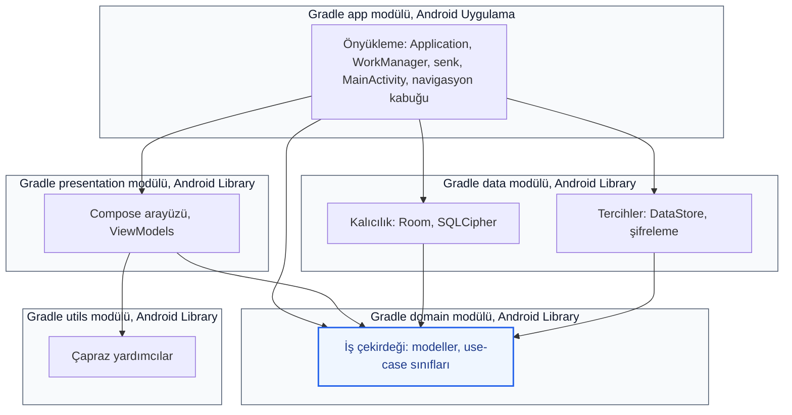

# FieldFlow

**Aktivasyon kodu :** **`123456`** — ilk kurulumda açılan aktivasyon ekranında **tam olarak** bu altı rakamı girin.

Bu çok modüllü uygulama **Kotlin** ve **Jetpack Compose** ile yazıldı: saha tarzı akışlar (kimlik tarama/OCR), biyometrik doğrulama, aktivasyon, harita ve canlı konum, cihaz üzerinde bildirimler, arka planda senkron ve olay günlüğü—hepsi tek kod tabanında.

**English:** [README.md](README.md)

---

## İçindekiler

- [Ekran kaydı](#ekran-kaydı)
- [Proje yapısı (modüller)](#proje-yapısı-modüller)
- [Mimari](#mimari)
- [Teknik gereksinimlerle uyum](#teknik-gereksinimlerle-uyum)
- [Teknoloji yığını](#teknoloji-yığını)
- [Özellikler](#özellikler)
- [Çevrimdışı çalışma](#çevrimdışı-çalışma)
- [İzinler ve arka plan davranışı](#izinler-ve-arka-plan-davranışı)
- [Bildirimler ve uyarılar](#bildirimler-ve-uyarlar)
- [Olay günlüğü (denetim izi)](#olay-günlüğü-denetim-izi)
- [Veri yaşam döngüsü, şifreleme ve cihaz güvenliği](#veri-yaşam-döngüsü-şifreleme-ve-cihaz-güvenliği)
- [Kurulum ve ortam hazırlığı](#kurulum-ve-ortam-hazırlığı)
- [Kalite: test ve lint](#kalite-test-ve-lint)
- [Sürekli entegrasyon (CI)](#sürekli-entegrasyon-ci)
- [Güvenlik ve gizlilik notları](#güvenlik-ve-gizlilik-notları)

---

## Ekran kaydı

https://github.com/user-attachments/assets/6b68f554-2015-4d10-a716-1f478e0d9088

https://github.com/user-attachments/assets/006d0a37-e08b-4424-a462-d6e7c81dac6d

https://github.com/user-attachments/assets/32b2ba24-16ed-467a-9d29-4d54e52cea31

---

## Proje yapısı (modüller)

| Modül | Tür | Rol |
|--------|-----|-----|
| **`:app`** | Android Application | `Application` sınıfı, `MainActivity`, navigasyon kabuğu, Hilt kökü, WorkManager yapılandırması, OSMDroid başlatma, ağ üzerinden senkron planlama, ön planda konum servisi |
| **`:presentation`** | Android Library | Jetpack Compose arayüzleri, ViewModel katmanı, CameraX, ML Kit OCR (kimlik tarama ekranı), harita ekranı (OSMDroid), biyometrik ve ayar ekranları |
| **`:domain`** | Android Library | İş kuralları ve modeller; çerçeveden mümkün olduğunca bağımsız katman |
| **`:data`** | Android Library | Kalıcılık: Room, SQLCipher ile şifreli veritabanı, DataStore, AndroidX Security Crypto, Play Services Location, ML Kit |
| **`:utils`** | Android Library | Ortak yardımcılar (güvenlik ipuçları, küçük yardımcılar) |

Çoklu modül yapılandırması `settings.gradle.kts` içindedir; sürümler **Version Catalog** (`gradle/libs.versions.toml`) dosyasında toplanır.

---

## Mimari

Uygulama **katmanlı** bir yapıda kuruldu:

- **Presentation**: Arayüz (Compose), kullanıcı etkileşimi, ViewModel.
- **Domain**: Modeller ve iş kuralları.
- **Data**: Repository / veri kaynakları, şifreli Room depolama, tercihler.

**Bağımlılık enjeksiyonu** [Dagger Hilt](https://dagger.dev/hilt/) ile yapılır; işleme **KSP** üzerinden çalışır.

**Navigasyon** [AndroidX Navigation 3](https://developer.android.com/jetpack/androidx/releases/navigation) (`navigation3-runtime`, `navigation3-ui`) ve **Kotlin Serialization** ile serileştirilen rota anahtarları (`NavKey`) kullanılır.

**Gradle modül bağımlılık grafiği:**



---

## Teknik gereksinimlerle uyum

FieldFlow, tipik bir ödev veya teknik şartname kapsamında beklenen maddeleri karşılayacak şekilde düzenlenmiş bir projedir; bu maddelerin kodda nerede olduğunu aşağıda topladık.

### Mimari: katmanlı ayrım ve arayüz deseni

- **Katmanlar**: Kod tabanı, yukarıda anlatılan **katmanlı** sınırları kullanır: **presentation** (arayüz), **domain** (modeller + use case’ler), **data** (Room repository’leri, DataStore, platform köprüleri). Bağımlılıklar **domain**’e doğru içeridir.
- **Arayüz deseni**: Sunum katmanında birincil desen **MVVM**’dir; **MVI** birincil desen olarak kullanılmaz:
  - Jetpack **`ViewModel`** + **`StateFlow`** / `*UiState` veri sınıfları (`IdScanUiState`, `MapUiState`, vb.).
  - Compose ekranları durumu yaşam döngüsüne uygun şekilde toplar ve eylemleri ViewModel veya lambda’lara iletir.
  - **`UseCase`** sınıfları tek sorumluluğu domain’de kapsar (`SaveLocationUseCase`, `ObserveRecentLocationsUseCase`, vb.).
- **Sunum deseni notu**: Tek bir sealed `UiEvent` reducer yok; her ekranın ViewModel’i kendi güncellemelerini tutuyor. Yapı **MVVM + tek yönlü durum**; katı bir MVI olay deposu değil.

### Kod kalitesi

- **İsimlendirme**: Paketler ve tipler yaygın Kotlin/Android kalıplarına uyar (`*Repository`, `*UseCase`, `*ViewModel`, `*Screen`).
- **Tekrar**: Yinelenen davranış mümkün olduğunca **domain use case** ve **repository** katmanına taşınır; paylaşılan arayüz parçaları gerektiğinde ayrıştırılır.
- **Kontroller**: Modüller arası **birim testleri** use case ve ViewModel gerilemelerini yakalamaya yardım eder (bkz. [Kalite: test ve lint](#kalite-test-ve-lint)).

### Güvenlik (hassas veri + root)

- **Şifreli saklama**: Konum geçmişi, olay günlükleri, bildirimler, geofence verisi vb. **aynı SQLCipher korumalı Room veritabanında** tutulur; parola **EncryptedSharedPreferences** içindedir. Ayrıntılar için bkz. [Veri yaşam döngüsü, şifreleme ve cihaz güvenliği](#veri-yaşam-döngüsü-şifreleme-ve-cihaz-güvenliği).
- **Root**: **`RootDetector`** (`utils`), **`Build.TAGS`** ve **`su`**, **Magisk**, **`Superuser.apk`** gibi bilinen yolları kontrol ederek özelleştirilmiş veya rootlu kurulumlara işaret eder. **`MainNavigationHost`** bilgilendirici **`AlertDialog`** gösterir; kullanıcı onayladıktan sonra **`MainActivity`** akışı kesmeden çalışmaya devam eder.

### Hata yönetimi (kullanıcı vs teknik)

- **İlke**: Geliştirici tarafında **`Log`** ve stack trace; kullanıcı tarafında **`strings.xml`** içindeki **kısa, anlaşılır** metinler—ham `Exception.message` doğrudan gösterilmez.
- **Örnekler**:
  - **Kimlik tarama**: CameraX / ML Kit hatalarında `id_scan_photo_capture_failed`, `id_scan_text_read_failed`, `image_processing_failed` gibi kaynaklar kullanılır; teknik ayrıntı **`Log.w`** ile kalır.
  - **Biyometrik**: `BiometricPrompt` hata kodları **`messageForPromptAuthenticationError`** ile kullanıcı güvenli dizelere (`biometric_unavailable`, kilit, zaman aşımı vb.) çevrilir; çerçeveden gelen ham metin gösterilmez.
- **Yeni ekranlar**: Aynı alışkanlık geçerli—ham `exception.message`’ı Compose veya Toast’a yapıştırmadan önce süzmeyi unutmayın.

---

## Teknoloji yığını

Aşağıda Gradle’a gerçekten eklenen başlıca kütüphaneler var; tam sürüm referansları `gradle/libs.versions.toml` içinde.

### Platform ve dil

| Bileşen | Notlar |
|---------|--------|
| **Kotlin** | 2.0.21 |
| **Android Gradle Plugin (AGP)** | 8.10.1 |
| **KSP** | 2.0.21-1.0.28 |
| **JVM hedefi (kaynak)** | Java 11 (`compileOptions` / `kotlinOptions.jvmTarget`) |
| **minSdk / compileSdk / targetSdk** | 24 / 36 / 36 |
| **Uygulama kimliği** | `com.example.fieldflow` |

### AndroidX ve arayüz

| Kütüphane | Sürüm (ref) | Kullanım |
|-----------|-------------|----------|
| **core-ktx** | 1.18.0 | Kotlin uzantıları |
| **Activity Compose** | 1.11.0 | `ComponentActivity` + Compose |
| **Compose BOM** | 2024.09.00 | Compose sürüm hizalama |
| **Material 3** | (BOM) | Tasarım sistemi |
| **material-icons-extended** | (BOM) | Geniş ikon seti (`presentation`) |
| **lifecycle-runtime-ktx** | 2.9.4 | Yaşam döngüsü |
| **lifecycle-viewmodel-compose** | 2.9.4 | ViewModel + Compose |
| **navigation-compose** | 2.8.5 | Katalogda tanımlı; modüller ağırlıklı olarak Navigation 3 kullanır |
| **Navigation 3** runtime + ui | 1.1.1 | Tip güvenli geri yığın navigasyonu |
| **Biometric** | 1.1.0 | Parmak izi / yüz kilidi |
| **CameraX** (core, camera2, lifecycle, view) | 1.6.1 | Kamera önizleme ve yakalama |
| **WorkManager** (KTX) | 2.9.1 | Arka plan işleri |
| **DataStore Preferences** | 1.1.1 | Tercihler / hafif yapılandırma |
| **Room** (runtime, ktx) | 2.7.0 | Yerel ilişkisel veri |
| **security-crypto** | 1.1.0 | Keystore destekli güvenli tercihler |
| **SQLCipher (android-database-sqlcipher)** | 4.5.4 | Şifreli SQLite |

### Google, harita ve konum

| Kütüphane | Sürüm | Kullanım |
|-----------|--------|----------|
| **Play Services Location** | 21.3.0 | Konum API’leri |
| **ML Kit Text Recognition** | 16.0.1 | Kimlik / metin OCR |
| **OSMDroid** | 6.1.20 | Açık harita karosu tabanlı harita görünümü |

### DI ve asenkron kod

| Kütüphane | Sürüm | Kullanım |
|-----------|--------|----------|
| **Hilt** (Android) | 2.51.1 | Uygulama geneli DI |
| **Hilt Navigation Compose** | 1.2.0 | Compose ile Hilt |
| **Hilt Work** + **Hilt Compiler (AndroidX)** | 1.2.0 | WorkManager worker enjeksiyonu |
| **Kotlin Coroutines** (android) | 1.8.1 | Asenkron akışlar |
| **kotlinx-serialization-json** | 1.7.3 | Rota ve yapılandırma serileştirmesi |

### Test

| Kütüphane | Sürüm | Kullanım |
|-----------|--------|----------|
| **JUnit 4** | 4.13.2 | Birim testleri |
| **AndroidX Test JUnit** | 1.3.0 | Enstrümantasyon test altyapısı |
| **Espresso** | 3.7.0 | UI testleri |
| **kotlinx-coroutines-test** | 1.8.1 | Dispatcher kontrolü |
| **AndroidX Test Core** | 1.6.1 | Test double’ları / Android bileşenleri |
| **Robolectric** | 4.14.1 | JVM üzerinde Android birim testleri |
| **Compose UI Test (JUnit4)** | (BOM) | Compose UI testleri |

### Araç zinciri

- **Gradle Wrapper** (CI’da doğrulanır: `gradle/actions/wrapper-validation`)
- **Version Catalog** (`libs.versions.toml`)
- Release derlemeleri: **R8** kod küçültme ve kaynak budama (`app` modülünde etkin)

---

## Özellikler

Kabaca kullanıcı akışı:

1. **Açılış / kimlik tarama**: ML Kit OCR ve CameraX ile `IdScanScreen`.
2. **Etkinleştirme**: Taramadan sonra `ActivationCodeScreen` aktivasyon kodu akışı.
3. **Biyometrik doğrulama**: `BiometricAuthScreen`.
4. **Ana sayfa**: `HomeScreen` — harita ve olay günlüğüne geçiş.
5. **Harita**: OSMDroid tabanlı `MapScreen`.
6. **Olay günlüğü**: `EventLogScreen`.
7. **Bildirimler**: Liste ve detay ekranları; `MainActivity` ekleriyle derin bağlantı tarzı yönlendirme.
8. **Ayarlar**: `SettingsScreen`.

### Ayarlar tercihleri (`SettingsScreen`)

**`MainNavDisplay`**, **`SettingsScreen(isActivated = …)`** çağrısına etkinleşme bayrağı geçirir; tamamlanmamış kurulumdaysa **`SettingsSectionCard`** ilgili bölümü kilitliyor (**`presentation/.../SettingsScreen.kt`**). Tercihler **`SettingsRepositoryImpl`** (**Preferences DataStore**) üzerinden tutulur; **`activation_prefs`** ile aynı şifreli mağaza değildir (bkz. **[Ayarlar ve sırlar](#ayarlar-ve-sırlar)**). **`SettingsViewModel`**, **`UserPreferences`** çıktısını **`StateFlow`** ile yayar.

**Dil.** **Türkçe** (**`AppLanguage.TURKISH`**, kod **`tr`**) ile **İngilizce** (**`AppLanguage.ENGLISH`**, kod **`en`**) seçimleri iki **`ElevatedFilterChip`** ile yapılır. **`FieldFlowApp`**, **`prefs.language`** değişince **`Locale.setDefault`** ve **`Activity.resources.updateConfiguration`** kullanarak kaynak seçimini **`values`** / **`values-tr`** arasında kaydırır; **`LocalConfiguration`** **`CompositionLocalProvider`** ile yenilenir (**`MainActivity`** yeniden yaratmadan Compose metinleri güncellenir).

**Konum güncelleme sıklığı.** **`LOCATION_INTERVALS`** ile **30 / 60 / 120 / 300** saniye seçenekleri sunulur. **`isActivated` false** iken çipler devre dışıdır (**`locked = true`** + **`lockedHint`** metni **`strings`** kaynaklarında). Aktivasyon sonrası **`setLocationInterval`**, **`location_interval_seconds`** değerini yazar (**`UserPreferences`** şemasında öntanımlı **60** saniye). Fused güncelleme zincirine mirası için bkz. **[Örnekleme sıklığı ve yerel kalıcılık](#örnekleme-sıklığı-ve-yerel-kalıcılık)**.

**Tema.** **Açık**, **koyu** ve **sistem (cihaz gece modu)** çipleri **`AppTheme.LIGHT`**, **`DARK`**, **`SYSTEM`** ile eşlenir; ilk değerler **`SYSTEM`**. **`FieldFlowTheme`**, sistem modundayken **`isSystemInDarkTheme()`** okur ve yalnızca **`prefs.theme == SYSTEM`** iken **Material 3** **`dynamicColor`** bayrağı açık kalır (**`FieldFlowApp`**).

### İlk kurulum: kimlik OCR, aktivasyon kodu ve sonraki biyometrik giriş

**`AppActivationStore.isActivated`** akışı **false** olduğunda **`MainNavigationHost`**, **`SplashRoute`** üzerinden **`ScanRoute`**’a geçer; böylece ilk oturumda kullanıcı **`IdScanScreen`** ile karşılanır.

**Kart yakalama ve OCR.** Arayüz metni (**`presentation/src/main/res`** altındaki kaynak dosyalar, ör. Türkçe **`id_scan_description`**) kimliğin **ön yüzünün** kameraya gösterilmesini söyler; çerçeve **`IdCardViewfinderOverlay`** ile hizalanır. **CameraX** **`ImageCapture`** kare yakalar; **ML Kit Text Recognition** OCR (**`captureAndRunOcr`**) çıktısını **`IdScanViewModel`** ve **`IdentityTextParser`** ad/soyad biçiminde **`IdentityInfo`** olarak ayrıştırır. **Ayrıntıları elle gir** yolu (**`IdScanConfirmContent`**) fotoğraf çekmeden aynı onay akışına girer ve **`MainNavRouter.onIdentityDetected`** çağrılır.

Onaydan sonra **`onIdentityDetected`**, parametre olarak taşınan ad/soyad ile **`ActivationRoute`** satırına **`NavBackStack`** üzerinden eklenir (**`NavKey`** tipleri ile serileştirilmiş rota anahtarı).

**Aktivasyon.** **`ActivationCodeScreen`**, kullanıcı girişini **`AppActivationStore.getExpectedActivationCode()`** ile karşılaştırır; beklenen değer önce **`app/.../activation`** altındaki **`EmbeddedActivationPayload`** gömülü AES-GCM yükünden çözülür, ardından donanım **Keystore** AES-GCM ile **`activation_prefs` DataStore** içinde yeniden mühürlenebilir. Bu şablonda **uzaktan OTP** yoktur.

**Referans aktivasyon değeri (şablon derleme).** Arayüz yalnızca **rakam** kabul eder, girişi **en fazla 6** haneyle sınırlar; **`trim`** sonrası girdi ile **`expectedCode`** arasında **tam eşleşme** ve her iki taraf için **uzunluk 6** sağlanmadan **`ActivationCodeScreen`** içindeki **`onActivationSuccess`** tetiklenmez — aksi durumda **`activation_invalid_code`** gösterilir ve **`is_activated`** **false** kalır (ör. **Ayarlar**’daki konum sıklığı bölümü kilitli kalır). **Bu şablonda demo aktivasyon kodu `123456`dır**; yalnızca yerel deneme içindir. Üretime çıkmadan önce gömülü yükü (**`EmbeddedActivationPayload`**, **`CIPHER_TEXT_B64`**)

**Eşleşme** olduğunda yönlendirme tarafında **`onActivationCodeSuccess`**, **`is_activated = true`** yazar (**`setActivated`**), **`MainNavigationHost`** içinde **`rememberSaveable`** ile tutulan **`isBiometricVerified`** bayrağını **true** yapar ve **`HomeRoute`**’a gider — dolayısıyla **aynı aktivasyon oturumunda** **BiometricPrompt** atlanır. **`is_activated`** silinmediği sürece kimlik tarama ve kod ekranı tekrar edilmez; veri sıfırlandığında zincir yeniden işler.

**Sonraki açılışlar.** Yeni bir **`MainActivity`** örneğinde **`isBiometricVerified`** varsayılan **false**’tur; **`isActivated` true** ve bayrak **false** iken **`MainNavigationHost`**, **`BiometricRoute`** üzerinden **`BiometricAuthScreen`** gösterir. Kod **`BiometricManager.canAuthenticate(BiometricManager.Authenticators.BIOMETRIC_WEAK)`** sonra **`BiometricPrompt`** kullanır — yüz ile kilidi açma, parmak izi veya cihazın “zayıf biyometri” olarak sunduğu yerel yöntemler OEM’e bağlıdır (**sunucuya gitmez**). Başarıda **`HomeRoute`** açılır. **`rememberSaveable`**, süreç yeniden oluşumlarında **`true`** saklayabilir; her soğuk açılışta da biyometrik istemeniz gerekiyorsa **`SavedStateRegistry`** kalıcılığının politikanıza uyup uymadığını değerlendirmeniz yeterli olur.

### Güzergâh oynatma

Harita ekranı, ayrı bir medya zaman çizgisinden çok saklanmış konum artıkları üzerinden hareketin görsel olarak yeniden oluşturulmasını sunar. Son dönem konumlar **`ObserveRecentLocationsUseCase`** ile **`MapViewModel`**’e düşer; çizilmiş rota **`MapUiState`** üzerinden poliline yansır. İz için en az **iki** kayıtlı nokta bulunduğunda alt sayfada çıkan denetim **`startPlayback()`** çağrısına bağlanır; bu da kapsamlı bir coroutine işi başlatır. **`PlaybackState`** ve indeks alanı (**`presentation`** modülünde **`PLAYBACK_STEP_MS`**, adım süresi **500 ms**) her beklemeli adımda ilerleyerek polilin yalnızca o ana kadarki önekini görünür kılar ve vurgulanan konum imi o anda seçilen örnekle hizalanır. **`stopPlayback()`**, işlemi iptal eder ve geçici indeksi sıfırlar — normal görünümde tam iz, **`uiState`** bileşimi kurallarına göre yeniden gösterilir. Oynatma yalnızca gözlemci arkasındaki şifreli Room verisinden beslenir; inceleme sırasında karo indirmesi veya dış servis çağrısı gerektirmez.

### Iz penceresi ve “güncel konum” imi

`MapScreen`, iz **`Polyline`** parçalarını **`MapUiState.trackPoints`** listesinden alır; bu liste **`MapViewModel`** içinde **`ObserveRecentLocationsUseCase`** çıkışından türer. Zincir **`DAY_MS`** kullanarak (**24 × 60 × 60 × 1000** ms) **`getLocationsAfter(System.currentTimeMillis() - DAY_MS)`** ile **`timestamp`** değeri bu geriye dönüş penceresinin içinde kalan **`location_records`** örneklerini Flow ile sunar; **`LocationDao`** sorgusu **`ORDER BY timestamp ASC`** sıralamasını uygular. Ekranda görünür örnekler **`SaveLocationUseCase`** budamasına da bağlıdır; süre politikasıyla birlikte değerlendirmek için bkz. [Veri yaşam döngüsü, şifreleme ve cihaz güvenliği](#veri-yaşam-döngüsü-şifreleme-ve-cihaz-güvenliği) içindeki **Konum geçmişi: 24 saatlik pencere (ve 7 günlük güvenlik ağı)**.

**Güncel konum** başlığı altında gösterilen im **`MapUiState.currentLocation`** alanındadır; **`MapViewModel`** bunu sözü edilen sıralı noktalarda **`records.lastOrNull()`** ile atar — bu, Compose yüzünde yalnızca harita için açılmış, **`FusedLocationProviderClient`** tabanlı ayrı bir **sürekli konum yayını ile** güncellenen bir okuma değildir. **`LocationForegroundService`** izleme sırasında her **`LocationDao.insert`** sonrasında **`Room`** Flow’unun yenilenmesi ile im son kalıcı koordinata geçer; yeni düzeltme yazılmadıkça cihaz hareket etse bile görsel sabit kalabilir. **`MapScreen`**, daha önce hiç kayıtlı iz yokken yalnızca **ilk** merkezlemeyi yaklaştırmak için **`LocationManager#getLastKnownLocation`** okuyabilir (**`LaunchedEffect`**, `currentLocation` boşken); bu yol günlük iz çizgisini beslemez.

**Güzergâh oynatma** etkinken im **`OsmMapView`** içinde **`trackPoints.getOrNull(playbackIndex)`** ile o adımdaki örneği gösterir; **`lastOrNull()`** semantiğinden ayrılır.

Arka planda:

- Senkron için **WorkManager**; `FieldFlowApplication` doğrulanmış internet geldiğinde senkronu planlamak için **ağ geri çağrısı** kaydeder, ayrıca periyodik yedek plan vardır.
- **`LocationForegroundService`**: `location` ön plan servisi türü.
- **OSMDroid**: önbellek ve kullanıcı aracısı `Application.onCreate` içinde yapılandırılır.

---

## Çevrimdışı çalışma

Ayrı bir “çevrimdışı mod” düğmesi yok. Veriler önce **cihaz veritabanında** duruyor; arka plan senkronu yalnızca işletim sistemi bağlantının gerçekten kullanılabilir olduğunu söylediğinde devreye giriyor—yani ağ kesilince de uygulama işlevini sürdürebiliyor.

### Bağlantı yokken yerel kalıcılık

**Konumlar**

- **`LocationForegroundService`**, düzeltmeleri **`FusedLocationProviderClient`** üzerinden **paket verisi olmadan** da talep edebilir. GNSS / fused mantığı uygunsa **Wi‑Fi ve mobil veri kapalıyken** bile koordinat üretilebilir.
- Her kabul edilen düzeltme **`SaveLocationUseCase`** → **`LocationRepository`** → **`LocationDao.insert`** zinciriyle yazılır. Bu yolda **internet kontrolü yoktur**: kesinti **kalıcı yazmayı engellemez**.
- Satırlar **`location_records`** (`LocationEntity`) içinde, bir senkron geçişine kadar **`is_synced = false`** olarak durur.

**Olay kayıtları**

- **`SaveEventUseCase`**, **`event_records`** tablosuna doğrudan yazar (aynı şifreli Room veritabanı). Bağlantı değişimleri civarında **`LocationForegroundService`** içinde **`StatusRepository.observeConnectivity()`** durumu değişince üretilen **`INTERNET_LOST`** / **`INTERNET_RESTORED`** kayıtları buna örnektir — tamamen **önce yerel** akıştır.
- Geofence yaşam döngüsü ve diğer etkinlik kayıtları aynı repository yolunu kullanır.

**Depolama özellikleri**

- Her iki veri türü de **SQLCipher korumalı Room** (`fieldflow.db`) içindedir; çevrimdışı birikim [Veri yaşam döngüsü, şifreleme ve cihaz güvenliği](#veri-yaşam-döngüsü-şifreleme-ve-cihaz-güvenliği) bölümündeki **beklemede şifreleme** ile aynı koruma düzeyinden yararlanır.
- **Senkronize edilmemiş** konum satırları, senkronize olanlara göre **daha uzun** tutulur (**7 gün** penceresi, karşılığında senkronize için **24 saat** budaması) — kısa süreli kesintilerde **`SyncWorker`** çalışmadan noktaların düşmesini önlemek için bilinçli tasarımdır (ayrıntılar için [Veri yaşam döngüsü…](#veri-yaşam-döngüsü-şifreleme-ve-cihaz-güvenliği) içindeki konum saklama tablosu).

### Bağlantı yeniden kurulduğunda otomatik işlem

**Tetikleyiciler**

1. **`FieldFlowApplication`**, **`ConnectivityManager.NetworkCallback`** kaydeder; özellikler **`NET_CAPABILITY_INTERNET`** ve **`NET_CAPABILITY_VALIDATED`** içerdiğinde **`SyncWorker.schedule`** çağrılır.
2. **`LocationForegroundService`**, **`observeConnectivity()`** akışını dinler: **çevrimiçi**ye geçişte yeniden **`SyncWorker.schedule`** ve **`INTERNET_RESTORED`** kaydı; kopuşta **`INTERNET_LOST`** ve gerektiğinde bildirim.
3. **Soğuk başlatma**: `onCreate` zaten **tek seferlik** senkron ve **`SYNC_PERIODIC_INTERVAL_HOURS`** ile **periyodik** yedek işi sıraya koyar; ikisi de **`NetworkType.CONNECTED`** kısıtına tabidir.

**SyncWorker yerel muhasebesi**

- **`SyncWorker`** yalnızca **`NetworkType.CONNECTED`** altında çalışır; **`getUnsyncedLocations()`** ve **`getUnsyncedEvents()`** çıktılarında **`is_synced = 1`** ve **`synced_at = şimdi`** yazar. Referans derlemesinde **HTTP ile uzak yükleme yoktur** — davranış özeti için bkz. [SyncWorker sorumlulukları](#syncworker-sorumlulukları).
- **`FieldFlowApplication`** geri çağrıları, ön plan servis gözlemcileri ve periyodik yedek iş, cihaz üzerinde **bağlantı sonrası otomatik işlem** zamanlar. Uzak mutabakat katmanı gerektiğinde aynı **`senkronize edilmemiş` satır kuyruğu** ve tetikleyiciler korunarak işçinin **içine** veya **ardına** eklenebilir.

### Zamansal bütünlük (zaman damgaları)

**Ölçüm zamanı ile senkron muhasebesi**

- **`location_records`** ve **`event_records`** üzerindeki **`timestamp`**, **olayın veya ölçümün gerçekleştiği anı** temsil eder (konumda çoğunlukla **`Location.getTime()`**, geçersizse **`System.currentTimeMillis()`**). **Insert anında bir kez** yazılır; **`markLocationsSynced`** / **`markEventsSynced`** çalıştığında **yeniden yazılmaz**.
- **`synced_at`** **ayrı bir sütundur**: satırın yerelde “senkron işaretlendiği” anı tutar — denetim ve saklama kuralları için kullanılabilir, özgün gözlem zamanını ezmez.

**Çevrimdışı süre**

- Saat sapması dışında, kesinti boyunca toplanan verinin **sırası ve kronolojisi** SQLite’ta korunur; yeniden bağlanmak geçmiş **`timestamp`** değerlerini sıfırlamaz veya birleştirmez.

### Diğer çevrimdışı kullanılabilir özellikler

- **Harita güzergâh oynatması**: Yerel **`ObserveRecentLocationsUseCase`** verisiyle çalışır ve ağ gerektirmez. Davranışın tam metni **Özellikler** bölümünde **Güzergâh oynatma** başlığı altında anlatılır.
- **Cihaz üzerinde OCR**: Modeller hazırsa **ML Kit** backend turu gerektirmez.
- **Etkinleştirme bayrağı**: Yerelde (**DataStore** / şifreleme yolu) saklanır — zaten etkinleştirilmiş oturumlarda açılış internet istemez.

### Harita karosu notu (**OSMDroid**)

Altlık **karolar** çoğunlukla **HTTPS** ile indirilir. Tam çevrimdışı harita genelde daha önce çevrimiçi oturumlarda **`cacheDir`** altına inmiş karoları gerektirir; sıfır önbellekli cihazda baz harita boş kalırken GPS iz düşümü görülebilir.

### Ana sayfa durum panosu (`HomeScreen`)

**`HomeScreen`** açıkken **`HomeViewModel`** içindeki **`combine`**, **`HomeUiState`** nesnesini güncel tutar; ana metnin altında sırayla şu beş özet görünür:

1. **İnternet** — **`StatusRepositoryImpl.observeConnectivity`**, **`NET_CAPABILITY_INTERNET`** ile süzülmüş **`NetworkRequest`** kullanarak **`ConnectivityManager.registerNetworkCallback`** kaydeder; ağlar internet yeteneğini kazanıp kaybedince boolean akar (**`distinctUntilChanged`** **`Flow`**). Kart **çevrimiçi / çevrimdışı** metnini gösterir ve **`launchSettingsSafely(ACTION_WIRELESS_SETTINGS)`** ile kablosuz ayarlara gider.
2. **Konum servisi (sistem anahtarı)** — **`observeLocationEnabled`**, **`LocationManager.MODE_CHANGED_ACTION`** için yayın alıcısı kaydeder ve **`LocationManager.isLocationEnabled`** değerini yeniden okuyarak OS düzeyinde konumun açık/kapalı geçişini yansıtır (**`StatusRepositoryImpl`**, Android **P** API notu).
3. **`ACCESS_BACKGROUND_LOCATION` (API 29+)** — Yalnızca **`Build.VERSION.SDK_INT ≥ Q`** iken kart çizilir; durum **`ContextCompat.checkSelfPermission`** ile (**`RuntimePermissions.hasBackgroundLocationPermission`**). Android sürekli izin değişimi yayını sunmadığı için **`HomeScreen`**, **`Lifecycle.Event.ON_RESUME`** ve izin **`ActivityResult`** dönüşünde **`refreshRuntimePermissions()`** çağırır.
4. **`POST_NOTIFICATIONS` (API 33+)** — Aynı **`checkSelfPermission`** anlık görüntüsü; **Tiramisu** altı sürümlerde bildirim varsayılan olarak verilmiş kabul edilir (**`HomeViewModel.checkNotificationPermission`**).
5. **Pil yüzdesi** — **`observeBatteryLevel`**, **`ACTION_BATTERY_CHANGED`** ile **`BatteryManager.EXTRA_LEVEL`** / **`EXTRA_SCALE`** okur; ilk değer **`HomeUiState`** varsayılanında **-1** iken **`BatteryStatusCard`** “ölçülüyor” kopyasını gösterir, ardından yüzde (**20%** altı uyarı stili) güncellenir.

**Burada ayrı kart olarak yok**: hassas / kaba ön planda konum izinleri (**`ACCESS_FINE_LOCATION`**, **`ACCESS_COARSE_LOCATION`**); bunlar **`LaunchedEffect`** ve **`rememberLauncherForActivityResult`** zinciriyle tetiklenir (bildirim ve arka plan izinleriyle sıralı). **`MapScreen`** ayrı olarak **`ACCESS_FINE_LOCATION`** eksikse **`PermissionRequired`** yüzeyini gösterir.

**`LocationForegroundService`**, bildirim ve olay yan etkileri için aynı **`StatusRepository`** akışlarını bu belgede **Çevrimdışı çalışma** bölümünde özetlenen biçimde dinlemeye devam eder.

---

## İzinler ve arka plan davranışı

`AndroidManifest.xml` içinde bildirilen başlıca izinler:

- **Ağ**: `INTERNET`, `ACCESS_NETWORK_STATE`
- **Kamera**: `CAMERA` (isteğe bağlı donanım: `camera` `required=false`)
- **Biyometrik**: `USE_BIOMETRIC`
- **Konum**: `ACCESS_FINE_LOCATION`, `ACCESS_COARSE_LOCATION`, `ACCESS_BACKGROUND_LOCATION`
- **Bildirimler**: `POST_NOTIFICATIONS`
- **Ön plan servisi**: `FOREGROUND_SERVICE`, `FOREGROUND_SERVICE_LOCATION`
- **Pil optimizasyonu**: `REQUEST_IGNORE_BATTERY_OPTIMIZATIONS`

WorkManager’ın varsayılan başlatıcısı manifest birleştirmesi ile kaldırılmıştır; yapılandırma uygulama seviyesinde **HiltWorkerFactory** ile sağlanır (özel başlatma).

---

## Bildirimler ve uyarılar

### Yerel bildirimler

Uyarılar **yerel bildirimdir**: **`NotificationHelper`** (`app` modülü) içinde **`NotificationManager`** / **`NotificationCompat`** ile **cihaz üzerinde** üretilirler; tetikleyiciler çoğunlukla izleme, geofence kuralları, bağlantı durumu veya pil eşikleridir. Bildirim içeriğini **uzaktan bir mesajlaşma sunucusu** tetiklemez.

### Yerel bildirim mimarisi

- **Kanallar**: `CHANNEL_TRACKING` (düşük önem, izleme sırasında sessiz **devamlı** ön plan bildirimi), `CHANNEL_GEOFENCE` (yüksek önemli uyarılar), `CHANNEL_SYSTEM` (bağlantı / konum servisi / pil).
- **Tetikleyiciler**: Geofence çıkışı, internet kaybı/geri gelişi yan etkileri, konum sağlayıcısı değişimleri ve pil eşikleri **`LocationForegroundService`** (ve ilgili akışlar) içinden `NotificationHelper` çağrılarını tetikler.
- **Uygulama içi geçmiş**: Birçok uyarı ayrıca **`SaveNotificationUseCase`** → Room ile **`NotificationRecord`** olarak saklanır; **`NotificationListScreen`** / **`NotificationDetailScreen`** bu kayıtları listeler.

### Gölge ile uygulama içi açıklama

İşletim sistemi **durum çubuğu / bildirim gölgesi** için **`strings.xml`** altında **genel** metinler seçilir (`notif_*_title`, `notif_*_text`). Geofence bölge **adı**, pil **sayısı** gibi bağlam **`PendingIntent`** eklerinde taşınır (`EXTRA_NOTIF_TYPE`, `EXTRA_NOTIF_TIMESTAMP`, `EXTRA_NOTIF_EXTRA_ARG`); **`MainActivity`** **`NotificationDetailScreen`** ile **`notif_*_detail`** şablonlarından tam açıklamayı gösterir.

| Uyarı | Gölgede `setContentTitle` / `setContentText` | Bağlamsal veri |
|-------|-----------------------------------------------|----------------|
| Geofence çıkışı | Genel “Security Alert” + **bölge adı içermeyen** kısa metin | Bölge **adı** yalnızca `extraArg` ile (yönlendirme + uygulama içi liste/detay) taşınır |
| İnternet kaybı | Genel bağlantı metni | Koordinat veya kimlik yok |
| Konum servisi kapalı | Genel “izleme durdu” metni | Koordinat yok |
| Düşük pil | Kısa satırda **pil yüzdesi** (`%1$d%%`) — operasyonel, GPS/kişisel veri değil | Tam açıklama detay ekranında |
| Ön plan izleme | Genel aktif/çalışıyor mesajı | Koordinat yok |

**Pratikte**

- **`NotificationHelper`**, gölgede **`BigTextStyle`** veya uzun gövde kullanmıyor; hassas uzun metnin kopyalanmasını engelliyor.
- **Liste satırları** (`NotificationListScreen`, `notificationSubtitle`) `extraArg` ile **tek satırlık özet** gösterebilir (ör. bölge adı); bu **uygulama içi** bir yüzey, OS gölgesi değil.
- **Unutmayın**: Kilit ekranı önizlemesi kullanıcı ve OS ayarına bağlı; gölgeyi **yarı kamusal** sayıp tanımlayıcıları azaltın (gerekirse pil yüzdesini tamamen uygulama içine alın).

---

## Olay günlüğü (denetim izi)

### Otomatik kalıcılık hattı

**`LocationForegroundService`**, **`StatusRepository`** üzerinden bağlantıyı, Android P+ konum sağlayıcı kullanılabilirliğini ve geofence histerezisini izler; koşulları sağlayan geçişler **`SaveEventUseCase`** ile şifreli **`event_records`** tablosuna **`EventRecord`** satırı ekler.

| Tetikleyici | `EventType` değerleri | Davranış |
|-------------|----------------------|----------|
| İnternet bağlantısı geçişleri | **`INTERNET_LOST`**, **`INTERNET_RESTORED`** | İlk örnek bastırılır; sonraki geçişler kalıcı yazılır. |
| Konum sağlayıcısı aç/kapa (Android P+) | **`LOCATION_SERVICE_DISABLED`**, **`LOCATION_SERVICE_ENABLED`** | Bağlantı akışıyla aynı bastırma politikası. |
| Geofence mantıksal giriş/çıkış | **`GEOFENCE_ENTER`**, **`GEOFENCE_EXIT`** | Ayrı geofence depolamasıyla birlikte; **`detail`** çoğunlukla okunabilir **bölge adı**dır. |

Düşük pil uyarıları **`NotificationHelper`** ile sunulur; **`EventRecord.EventType`** numaralandırmasına **pil** türü eklenmez — denetim kayıtları şu an bağlantı, sağlayıcı ve geofence olaylarını kapsar.

### `EventLogScreen` sunum modeli

**`EventLogViewModel`**, **`ObserveAllEventsUseCase`** zaman sıralı **`Flow`** çıktısını toplar. **`EventRecordCard`** bileşeni:

- **`EventRecord.EventType`** için yerelleştirilmiş başlık üretir.
- Oluşum anını **`toFormattedDate(timestamp)`** ile gösterir ( **`syncedAt`** muhasebesinden bağımsız ).
- Dolu **`detail`** için tek satırlık alt başlık üretir (geofence senaryolarında sık).
- İkon ve kart tonu ile kategori / önem iletir — kalıcı bir iş akışı **durum** enum’u değildir.

Varlık düzeyinde **`isSynced` / `syncedAt`** **`SyncWorker`** mutabakatı için saklanır; mevcut Compose yüzeyi **bekleyen / senkronize** rozetleri çizmiyor — alanlar entegrasyon ve olası genişlemeye açıktır.

### İsteğe bağlı operatör notları

**`EventRecord.note`** varsayılan olarak boştur. Satır seçimi **`NoteDialog`** açar; **`UpdateEventNoteUseCase`** metni **`EventRepository.updateNote`** ile kalıcı yapar. Önizleme yalnızca kullanıcı girişinden sonra gösterilir; otomatik kayıtlar için **zorunlu not** politikası yoktur.

---

## Veri yaşam döngüsü, şifreleme ve cihaz güvenliği

Bu bölümde **çalışan kodun ne yaptığını** anlatıyoruz; yalnızca hangi kütüphanelerin listeye eklendiğini değil.

### Konum geçmişi: 24 saatlik pencere (ve 7 günlük güvenlik ağı)

Konum saklama süreleri `domain/.../DataRetentionConstants.kt` içinde tanımlıdır:

| Sabit | Süre | Amaç |
|--------|------|------|
| `DAY_MS` | 24 saat | Arayüz ve budama kuralları için temel “gün” |
| `SYNCED_LOCATION_RETENTION_MS` | 24 saat | Her yeni konum kaydından sonra **zaten senkronize edilmiş** ve 24 saatten eski noktalar silinir |
| `UNSYNCED_LOCATION_RETENTION_MS` | 7 gün | Hâlâ **senkronize edilmemiş** satırlar yalnızca yedi günden eskiyse silinir (çevrimdışıyken WorkManager’ın işaretlemesi için ek süre) |

`SaveLocationUseCase` her zaman yeni noktayı ekler, ardından “şimdi”ye göre hesaplanan eşiklerle her iki silme yardımcısını çağırır. Böylece diskteki **senkronize** iz kabaca **son 24 saat** ile sınırlı kalır; **senkron bekleyen** veri daha uzun yaşayabilir.

Harita / “son konumlar” yolu `ObserveRecentLocationsUseCase` kullanır; bu da `getLocationsAfter(now - DAY_MS)` ile abone olur — yani arayüzün “güncel” saydığı veri, tabloda duran kayıtlar içinde **açıkça son 24 saat**tir.

### SyncWorker sorumlulukları

**`SyncWorker`**, **`NetworkType.CONNECTED`** koşulları sağlandığında (periyodik yedek dahil) çalışır; **senkronize edilmemiş** konum ve olay kayıtlarını **`is_synced`** ve güncel **`synced_at`** ile işaretler. Referans uygulamasında **HTTP yükleme** bulunmaz; uzak API eklemek aynı kuyruk semantiğini koruyarak işçi içinde veya sonrasında yapılabilir.

### Beklemede şifreleme (Room / SQLCipher)

1. **`DatabasePassphraseStore`** (`data` modülü) SQLCipher parolasını **EncryptedSharedPreferences** (`androidx.security:security-crypto`) içinde tutar: Android Keystore’da **AES-256-GCM** ana anahtar, tercih anahtarları/değerleri şifrelenir (SIV + GCM).
2. İlk açılışta **48 karakterlik** rastgele parola (`SecureRandom`) üretilir ve bu şifreli tercihlere yazılır.
3. **`DatabaseModule`** SQLCipher yerel kütüphanelerini yükler, Room’u `SupportFactory(passphraseBytes)` ile oluşturur; `fieldflow.db` böylece **SQLCipher ile şifreli** bir SQLite dosyasıdır.
4. **`SqlCipherDatabaseMigrator`** eski **düz metin** `fieldflow.db` dosyasını algılar, `sqlcipher_export` ile yeni şifreli dosyaya aktarır ve yedeği kaldırır. Migrasyon başarısız olursa dosyalar silinerek boş şifreli DB oluşturulmasına izin verilebilir; ayrıca Room **`fallbackToDestructiveMigration(true)`** ile yapılandırılmıştır — şema sorunları yerel veriyi silebilir. Şablon uygulama için kabul edilebilir, üretimde bilinçli karar gerekir.

Tüm **Room** tabloları (konumlar, olaylar, geofence bölgeleri/olayları, bildirimler vb.) bu tek şifreli veritabanı dosyasında yer alır.

### Etkinleştirme sırları (`AppActivationStore`)

Etkinleştirme akışı şunları saklar:

- `is_activated` değerini **Preferences DataStore** içinde (`activation_prefs`).
- Beklenen aktivasyon kodunu: önce **gömülü AES-GCM blob**’undan (derleme zamanı etiketinden **SHA-256 türetilmiş** AES anahtarı ile); ardından **donanım destekli / Keystore** AES-GCM anahtarı ile tekrar **mühürlenmiş** halde Base64 olarak DataStore’da. **Bu repoda gönderilen gömülü şifre, çözüldüğünde altı basamaklı `123456` metnidir — yalnızca yerel gösterim / lab içindir; üretim dağıtımından önce `EmbeddedActivationPayload` ve cihazdaki mühürlü kopyayı güncellemeniz önerilir.**

Yani yol **iki katmanlıdır**: gömülü/obfuscation + Keystore destekli şifreleme. Ürün yol haritanız merkezi kontrol gerektirdiğinde sunucu taraflı lisans veya kurumsal doğrulama ile yan yana kullanılabilir.

### Ayarlar ve sırlar

`SettingsRepositoryImpl` dil, tema ve **konum örnekleme aralığı** (varsayılan **60 saniye**) için ayrı bir **DataStore** kullanır. Bu tercihler EncryptedSharedPreferences/SQLCipher ile aynı koruma seviyesinde değildir; Android uygulama korumalı alanına (sandbox) güvenir.

### Root tespiti (cihaz şeffaflığı)

**`RootDetector`** (`utils`) şunları birleştirir:

- `Build.TAGS` içinde `test-keys` (resmi olmayan derlemelerde sık görülür).
- Sabit bir yol listesinde dosya varlığı (ör. `su`, **Magisk** yolları, `Superuser.apk`).

Bu sinyaller, tam bir işletim sistemi denetimi yapmadan **özelleştirme ipuçlarını** hızlıca öne çıkarır. **`MainNavigationHost`**, kullanıcıyı bilgilendirici **`AlertDialog`** gösterir; tek seferlik onaydan sonra akış sorunsuz sürer ve **`MainActivity`** bilinçli şekilde açık kalır—deneyimi kilitlemeden şeffaflığı güçlendirir. Daha derin doğrulama gerektiğinde Play Integrity, MDM araçları veya kendi uzaktan kontrolleriniz üzerine eklenebilir.

### Sürekli konum toplama ve geofence

**`LocationForegroundService`** (`location` türü):

- Kalıcı bildirimle (**`NotificationHelper`**) **ön plan** servisi olarak başlar.
- **Google Play services** `FusedLocationProviderClient` ile **yüksek doğruluk** kullanır; güncelleme aralığı kullanıcı ayarından gelir (`locationIntervalSeconds`, milisaniyeye çevrilir).
- Her düzeltmede **`SaveLocationUseCase`** (saklama kurallarını tetikler) ve depolanmış bölgelere karşı **`checkGeofences`** çalışır: histerezis (ayrı giriş/çıkış eşikleri ve **iki örnek ile doğrulama**) GPS titremesini azaltır.
- **GİRİŞ/ÇIKIŞ** geofence olayları Room’a yazılır ve genel **olay günlüğü**ne yansır; çıkışta (ve diğer sistem kaynaklı uyarılarda) bildirim gönderilebilir.

Servis çalışırken eşzamanlı olarak **bağlantı**, **konum servisinin açık/kapalı** durumu (P+) ve **pil seviyesi** izlenir; geçişler **`SaveEventUseCase`** ve bildirim yardımcılarına gider (ör. internet koptu, konum kapalı, pil düşük).

#### Örnekleme sıklığı ve yerel kalıcılık

**Izleme yaşam döngüsü.** Kullanıcı **izlemeyi** açınca **`TrackingRepositoryImpl`**, **`LocationForegroundService`**’i başlatır. Sürekli düzeltme akışının taşıdığı servis **`location`** türünde bir **ön plan** servisi ve kalıcı bildirimi taşır; koordinatlar için ayrı bir periyodik WorkManager anketi kullanılmaz.

**Parametrik aralık.** Birleşik güncelleme süresinin hedefi **`UserPreferences.locationIntervalSeconds`** alanındadır; değer **`settingsRepository.preferences`** üzerinden okunur ve **`SettingsRepositoryImpl`** içinde **Preferences DataStore**’da **`location_interval_seconds`** anahtarıyla saklanır. Tercih yoksa varsayılan **60 saniye** kullanılır. **`SettingsScreen`** yalnızca **etkinleştirmeden sonra** seçilebilen **30 / 60 / 120 / 300** saniye çipleri sunar (**`LOCATION_INTERVALS`**); değişimler **`SettingsViewModel`** ile repository’ye yazılır. Servis **`startObservingInterval()`** ile saniye değerini milisaniyeye çevirip (**`distinctUntilChanged`**) **`restartLocationUpdates`** ile önceki aboneliği kaldırıp yeniden **`requestLocationUpdates`** talep eder.

**İstek biçimi.** **`startLocationUpdates`**, **`LocationRequest.Builder(Priority.PRIORITY_HIGH_ACCURACY, intervalMs)`**, **`setMinUpdateIntervalMillis(intervalMs / 2)`** oluşturur ve **`LocationCallback`**’i **`FusedLocationProviderClient`**’e bağlar. **`PRIORITY_HIGH_ACCURACY`**, donanımda yalnızca **`GPS_PROVIDER`**’a kilitlenen sabit frekanslı bir örnekleme anlamına gelmez; Play services tarafından sunulan fused (GNSS ve diğer sinyaller) yolunun yüksek doğruluğunu ister.

**SQLite yazımı.** Her **`onLocationResult`** çıktısı **`Location`**’dan **`LocationRecord`** (enlem/boylam, geçerliyse **`location.time`**, aksi **`System.currentTimeMillis()`**) üretilir; **`SaveLocationUseCase`** üzerinden **`LocationRepository`** → **`LocationDao.insert`** ile **`location_records`** içine yazılır; ardından aynı kullanıcı durumundan saklama budamaları uygulanır. Tablo daha geniş şifreli Room bağlamına [Veri yaşam döngüsü, şifreleme ve cihaz güvenliği](#veri-yaşam-döngüsü-şifreleme-ve-cihaz-güvenliği) ile uyumludur.

Fiilen iki düzeltme arası süre OEM enerji politikalarına, chipset davranışına, fused sağlayıcı gecikmesine ve uygun ise **`ACCESS_BACKGROUND_LOCATION`** bağlamına göre sapar; kullanıcı konumu kapattığında da durur. **`intervalMs`**, işletim sistemi için nominal hedef, duvar saati SLA’sı değildir.

#### Güvenli bölgeler (dairesel geofence)

Güvenli bölgeler **dairesel** modellenir. **`GeofenceZone`**; **`centerLat`**, **`centerLng`** ve **`radiusMeters`** saklar. **`MapScreen`** her bölgeyi daireyi yaklaşıklayan çokgenle çizer (**`generateCirclePoints`**). **`LocationForegroundService`** her düzeltmede merkeze **`Location.distanceBetween`** uygular; **`GeofencingClient`** kullanılmaz.

**`geofence_zones`** tablosu ilk kurulumda **boştur**; öntanımlı bölge yoktur. Bölgeler yalnızca harita akışıyla oluşturulur (ad, enlem, boylam, yarıçap).

**`LocationForegroundService`** konum güncellemeleri gelirken her birleştirilmiş düzeltmeden sonra **`checkGeofences`** çağırır. Servis çalışmıyorsa veya bölgeler yoksa sınıflandırma yapılmaz. Geçişlerin zamanlaması **`locationIntervalSeconds`**, fused düzeltme sıklığı, **`ACCESS_BACKGROUND_LOCATION`** iznine bağlı senaryolar ve OEM ön plan/arka plan kısıtlarına bağlıdır.

Çıkış için sınır, nominal **`radiusMeters`** artı **`GEOFENCE_EXIT_HYSTERESIS_METERS`** (**25** m) olarak ele alınır; geçiş, **`GEOFENCE_CONFIRMATION_SAMPLES`** (**2**) üst üste uygun örnek sonrasında kesinleşir. Tekrar girişte kullanılan eşik **`enterThresholdMeters`** ve **`GEOFENCE_ENTER_HYSTERESIS_METERS`** ile **`LocationForegroundService`** companion’ında tanımlıdır.

**`prevInside → dışarı`** durumunda sırayla: **`SaveGeofenceEventUseCase`**, **`EXIT`** **`GeofenceEvent`** kaydını **`geofence_events`** tablosuna yazar; **`SaveEventUseCase`**, **`GEOFENCE_EXIT`** **`EventRecord`** satırını bölge adıyla **`detail`** alanında **`event_records`** içine ekler; **`NotificationHelper.sendGeofenceExitAlert`** **`CHANNEL_GEOFENCE`** üzerinde **yerel** bildirim gösterir ve **`NotificationRecord`** oluşturur. Bildirim gölgesindeki satırlar genel kalır (**[Bildirimler ve uyarılar](#bildirimler-ve-uyarlar)**; ek veriler bağlam için kullanılır).

**ENTER** için **`ENTER`** **`GeofenceEvent`** ve **`GEOFENCE_ENTER`** **`EventRecord`** aynı yapıyla yazılır; **`sendGeofenceExitAlert`** çağrısı yapılmaz.

### Kimlik tarama (OCR)

**Kimlik tarama** ekranı **CameraX** ve **ML Kit Text Recognition** kullanır. `IdScanViewModel` OCR metnini `IdentityInfo` (ad/soyad) olarak ayrıştırır; veri **etkinleştirme** navigasyon akışında kullanılır. OCR çıktısı başka yerde kalıcı hale getirilmedikçe ayrı bir kasada şifrelenmez.

### Olay günlüğü, geofence geçmişi, bildirimler

- **Olay kayıtları** (`event_records`) ve **bildirimler**, senkronize konumlarla aynı şekilde **otomatik 24 saatlik silme**ye sahip değildir; budama veya kullanıcı silme API’leri eklenene kadar birikir.
- Arayüzde **geofence olayları** varsayılan olarak `observeRecentEvents(limit = 50)` ile izlenir — son **adet** limiti, 24 saatlik kesme değil.

### Güvenlik özeti (kısa)

| Katman | Tipik endişe | FieldFlow neyi güçlendirir |
|--------|----------------|---------------------------|
| SQLCipher + şifreli parola deposu | Cihazın çalınması veya uygulama depolamasının kopyalanması | Yerel veritabanı bekleyen şifrede kalır; parola düz metin olarak durmaz |
| Keystore + GCM (etkinleştirme) | Disk üzerindeki aktivasyon verisinin kurcalanması | Donanım destekli mühürle sıradan müdahaleyi zorlaştırır |
| Root tespiti + diyalog | Özelleştirilmiş veya rootlu Android ortamı | Kısa bilgilendirme; onaydan sonra akış kesintisiz devam eder |
| Ön plan konumu + açık izinler | Görünmez arka plan izlemesi | İzleme görünür ön plan bildirimi ve açık çalışma zamanı izinleriyle bağlıdır |

---

## Kurulum ve ortam hazırlığı

### Ön koşullar

| Gereksinim | Notlar |
|------------|--------|
| **Android Studio** | **AGP 8.10.x** ile uyumlu güncel bir Studio (`gradle/libs.versions.toml`). Senkron hâlâ Android Gradle Plugin diye şikâyet ediyorsa önce Studio’yu yükseltin. |
| **JDK** | Kaynaklar **Java 11** ile derlenir. Gradle JDK olarak Studio’nun gömülü JDK’sını kullanın (**Ayarlar → Derleme … → Gradle → Gradle JDK**) takımınız başka bir şey istemiyorsa; CI **Eclipse Temurin 17** kullanıyor. |
| **Android SDK** | **`compileSdk` / `targetSdk`** için **API 36** kurulu olsun. En az bir **API 24+** emülatörle hızlı kontroller yapın. |
| **Google Play services** | Fused konum Play services bekler—mümkünse **Play Store / Play services** olan cihaz veya emülatör kullanın. |

### Depoyu alma ve projeyi açma

1. Projeyi **Git ile klonlayın** ya da indirdiğiniz arşivi bir klasöre çıkarın.
2. Android Studio’da **Dosya → Aç…** deyin ve **`settings.gradle.kts`** dosyasının durduğu klasörü seçin — projenin ana dizini bu; `:app` gibi bir alt modül klasörünü değil.
3. Studio güven uyarısı çıkarırsa projeye güvenmenizi isteyecektir; yerel geliştirme için **Trust / Güven** demek yeterli (Gradle projelerinde sıradan bir adım).

### Bağımlılık senkronizasyonu

Projeyi açınca Gradle genelde kendi kendine senkron olur. Elle yenilemek için **Dosya → Gradle ile Proje Dosyalarını Senkronize Et**. İlk indirmede Version Catalog’taki her şey gelir (**SQLCipher** dahil)—kurumsal ağınız depoları aynalıyorsa `settings.gradle.kts` ile uyumlu olmalı; değilse normal **HTTPS** erişimi gerekir.

SDK varsayılan yerde değilse kökte **`local.properties`** ekleyin:

```properties
sdk.dir=/mutlak/yol/Android/sdk
```

Studio genelde bu dosyayı sizin için yazar.

### Cihaz veya emülatörde çalıştırma

1. Mümkünse Play services içeren **API 24+** bir **AVD** oluşturun ya da **USB hata ayıklaması** açık telefon bağlayın.
2. Araç çubuğundan **`app`** çalıştırma yapılandırmasını seçin.
3. **Çalıştır → 'app' Çalıştır** — **`debug`** derlemesi varsayılan debug anahtarıyla yüklenir.

Tam özellikler için çıkan izinleri kabul edin: **kamera**, **kesin konum**, **bildirimler**, **arka plan konumu**.

### Gösterim aktivasyon kodu

README’nin üstündeki **altı haneli kod** yalnızca demoyu denemek içindir.

### Komut satırından derleme

macOS / Linux kök dizininde:

```bash
./gradlew assembleDebug
```

Bağlı cihaza yükleme:

```bash
./gradlew installDebug
```

Windows’ta aynı görev adlarıyla **`gradlew.bat`** kullanın.

### Sürüm paketleme

**`release`** APK/AAB için kendi **`signingConfig`** ve anahtarlığınızı tanımlayın; parolaları Git’e yazmayın (CI gizli değişkenleri, kasa veya yerel `gradle.properties` parçası). Şablonda **`applicationId`** hâlâ **`com.example.fieldflow`**; `app/build.gradle.kts` içinden değiştirin.

---

## Kalite: test ve lint

```bash
./gradlew testDebugUnitTest lint
```

### Birim test envanteri

Testler JVM üzerinde çalışır (`testDebugUnitTest`). Kitaplık modüllerde Android API veya gölge gerekiyorsa **Robolectric** devreye girer; ViewModel testleri için **kotlinx-coroutines-test** ve **`MainDispatcherRule`** (`presentation/src/test/.../MainDispatcherRule.kt`) `Dispatchers.Main`’i sabitler. Ortak sahte nesneler `presentation/src/test/.../fakes/` altında (ör. `Stubs.kt`).

| Modül | Kapsanan alanlar | Örnek test sınıfları |
|--------|------------------|----------------------|
| **`:domain`** | Modeller, use case’ler (konum saklama, geofence, bildirimler, olaylar, izleme) | `LocationUseCasesTest`, `GeofenceUseCasesTest`, `NotificationUseCasesTest`, `EventUseCasesTest`, `TrackingUseCasesTest`, `DomainModelRecordsTest` |
| **`:data`** | Repository uygulamaları → DAO/Room eşlemesi | `LocationRepositoryImplTest`, `EventRepositoryImplTest`, `NotificationRepositoryImplTest`, `GeofenceRepositoryImplTest` |
| **`:presentation`** | ViewModel’ler, OCR ayrıştırma | `IdScanViewModelTest`, `IdentityTextParserTest`, `HomeViewModelTest`, `MapViewModelTest`, `SettingsViewModelTest`, `NotificationListViewModelTest`, `EventLogViewModelTest` |
| **`:utils`** | Root ipuçları ve özelleştirme yardımcıları, küçük uzantılar | `RootDetectorTest`, `StringExtensionsTest`, `ConstantExtensionsTest` |
| **`:app`** | Rota serileştirme, uygulama sabitleri | `FieldFlowRouteSerializationTest`, `AppConstantsTest` |

Şu anda `**/src/test` altında **22** adet `*Test.kt` dosyası var. `androidTest` UI testleri bu repoda şart değil; CI birim testi ve lint ile yetiniyor.

---

## Sürekli entegrasyon (CI)

**FieldFlow Build** iş akışı `.github/workflows/fieldflow-build.yml` dosyasında. **Pull request**, `main` / `master` **push** ve elle **`workflow_dispatch`** ile tetiklenir.

Her koşu repoyu alır, Gradle Wrapper’ı doğrular, **JDK 17 (Temurin)** kurar, Gradle’ı hazırlar ve şunu çalıştırır:

```bash
./gradlew assembleDebug testDebugUnitTest lint --no-daemon --stacktrace --warning-mode=all
```

Başarısızlıkta **`build/reports/`** ve **`build/test-results/`** artifact olarak yüklenir; lint veya test çıktısına buradan bakılır. Aynı PR için eşzamanlı koşular iptal edilir (`concurrency`).

---

## Güvenlik ve gizlilik notları

Saklama, SQLCipher, etkinleştirme kriptosu, root tespiti ve konum izlemenin kodda nasıl birleştiği için bkz. **[Veri yaşam döngüsü, şifreleme ve cihaz güvenliği](#veri-yaşam-döngüsü-şifreleme-ve-cihaz-güvenliği)**.

- **İmza anahtarı** veya API sırlarını repoya gömmeyin; CI gizli değişkeni, `local.properties` veya başka bir kasa yeterli.
- **Konum**, **kamera** ve **biyometrik** akışlar hassas veri taşır.
- Cihaz üzerinde şifreleme, günlük kullanımda depolamayı meraklı gözlere karşı güçlendirir; geniş uyumluluk katmanlarıyla birlikte kullanılmaya uygundur.
